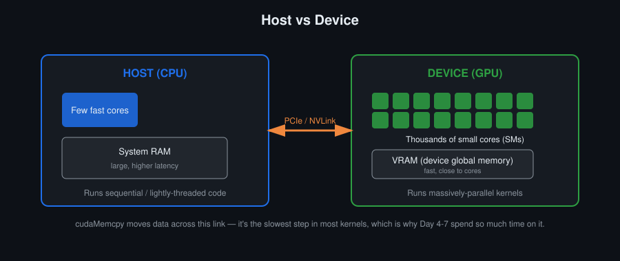

# Day 1: CUDA Programming Model and GPU Architecture

## Objectives
- Map the host/device split onto what you already know from MPI: two address spaces, explicit transfers, no coherence between them
- Describe the CUDA programming model: kernels, threads, blocks, grids
- Compile and run a `.cu` file with `nvcc`, and explain what nvcc produces (host object code, PTX, SASS)
- Read your own GPU's real numbers — SM count, registers per SM, shared memory per SM, warp size, memory bus width — and use them for the rest of the course
- Check every CUDA call, and explain why a kernel launch needs a different check than everything else

## Key Concepts
- Host vs device; why a GPU is a throughput machine and a CPU is a latency machine
- Kernels, threads, blocks, grids (overview only — detail on Day 2)
- Streaming multiprocessor: registers, ALUs, SFUs, tensor cores, warp schedulers, load/store units
- `nvcc`: host/device split, PTX vs SASS, virtual vs real architecture flags
- Error checking: `CUDA_CHECK`, `CUDA_CHECK_LAST_ERROR`
- `cudaGetDeviceProperties` and `report_device_capabilities()`

## Definitions
**Host** — The CPU, as opposed to the **device** (GPU).

**Device** — The GPU, as opposed to the **host** (CPU). Has its own memory space (VRAM), reached over PCIe or NVLink.

**Throughput machine and latency machine** — A CPU spends area on caches, branch prediction and out-of-order execution to make one instruction stream fast, that is, to reduce latency. A GPU spends the same area on execution units and register file to keep many warps in flight, and tolerates latency instead of removing it.

**Kernel** — A function marked `__global__`, launched from host code with `<<<grid, block>>>` syntax, executed by many threads in parallel on the device.

**SM (Streaming Multiprocessor)** — A GPU's core compute unit; a modern GPU has dozens to over a hundred. Each block runs entirely on one SM. Real counts and limits for your GPU are in `report_device_capabilities()`.

**Warp scheduler** — The SM unit that each cycle selects one eligible warp and issues its next instruction to the execution units. An SM has several.

**SFU (Special Function Unit)** — The SM units computing transcendental functions — sine, cosine, exponential, reciprocal, reciprocal square root — at lower throughput than the FP32 units.

**Load/store unit** — The SM units that issue memory instructions and compute addresses for global, local and shared memory accesses.

**nvcc** — The CUDA compiler driver. It separates a `.cu` file into host and device code, compiles the device part itself, passes the host part to the system compiler, and links both into one binary.

**PTX** — NVIDIA's virtual, forward-compatible GPU assembly language. nvcc compiles device code to PTX first; `ptxas` then assembles PTX into real machine code (**SASS**) for a specific architecture.

**SASS** — The real machine code (cubin) for one specific GPU architecture, assembled from PTX by `ptxas`.

**Virtual and real architecture** — `-arch=compute_XX` names the virtual architecture PTX is generated for; `-code=sm_XX` names the real architecture SASS is generated for. `-arch=sm_XX` sets both.

**Fat binary** — The single executable nvcc produces, holding host machine code together with one or more device images (PTX, SASS, or both). At launch the driver picks a matching SASS image, or JIT-compiles the embedded PTX if none matches.

**Compute capability** — A version number, for example `8.6`, identifying a GPU's architecture generation and feature set. Written as `sm_XX` and `compute_XX` in nvcc flags.

**`cudaGetDeviceProperties`** — The API call returning a `cudaDeviceProp` structure with the device's SM count, warp size, per-SM register and shared memory limits, clock rates, memory bus width and compute capability. `report_device_capabilities()` in `common/device_info.h` prints it.

## Note for this audience
Participants already write OpenMP and MPI. Two contrasts are worth making explicitly and are the fastest way into the model:

- **Against OpenMP.** An OpenMP thread is scheduled by the OS and owns a full context. A CUDA thread is one lane of a warp; 32 of them share one instruction stream. Divergence is therefore a hardware cost, not a scheduling cost.
- **Against MPI.** Host and device memory are separate address spaces with explicit transfers, which is familiar. What is different is that the transfer cost is not a network cost but a PCIe or NVLink cost, and it is usually the first thing that limits a naive port.

## Visual

Host and device are two address spaces joined by one link. Allocation, transfer and launch all cross it. The driver is not drawn: it runs on the host side and is what turns a `cudaMemcpy` or a launch into traffic on that link and commands in the GPU's queue.

## Animated

The cycle of a typical CUDA program: copy in, launch, copy out. The two copy legs are long relative to the launch itself. Days 4, 6 and 8 deal with that asymmetry.

The device path takes four steps before machine code exists; the host path takes two and then waits at the linker, because the binary cannot be assembled until both halves are there. PTX is where the virtual architecture is fixed, SASS where the real one is.

## Resources
- [CUDA C Programming Guide](https://docs.nvidia.com/cuda/pdf/CUDA_C_Programming_Guide.pdf) — 2. Programming Model · 4. Hardware Implementation · 16. Compute Capabilities
- CUDA C++ Best Practices Guide — Assess, Parallelize, Optimize, Deploy
- SM anatomy diagram and animations: [`sm_anatomy.svg`](../sm_anatomy.svg), [`sm_animations.html`](../sm_animations.html)
- [`ARCHITECTURE.md`](../ARCHITECTURE.md) — what is inside an SM, in detail

## Hands-On Task
Run `report_device_capabilities()` on the cluster GPU and write down the numbers. Then write and launch a minimal kernel that reports its own block and thread index. The goal is a clean compile-and-run cycle plus a record of the hardware you will be measuring against all course.

## Self-Learning
1. Print `Hello from block X, thread Y` with device-side `printf`, launched as `<<<1,1>>>`, `<<<2,4>>>`, `<<<4,32>>>`.
2. Have each thread write its raw `blockIdx.x` and `threadIdx.x` into two arrays; copy back and verify against the launch configuration.
3. From `report_device_capabilities()` output, compute the theoretical peak FP32 throughput and peak memory bandwidth of the cluster GPU. Compare with NVIDIA's published figures and account for the difference.
4. Compile the same kernel with `-arch=sm_75` and with `-arch=native`; dump SASS for both with `cuobjdump --dump-sass` and diff the output.
5. Launch with 5000 threads per block once without `CUDA_CHECK_LAST_ERROR()` and once with it. Note what each run tells you.

## Self-Check
No answers given.

1. Why can a kernel launch not return a `cudaError_t` the way `cudaMalloc` does?
2. Why does nvcc emit PTX before machine code, and what does that buy you when the cluster is upgraded?
3. Your GPU reports N SMs and a peak bandwidth of B GB/s. Which of the two numbers will limit a vector addition, and how do you know before running it?
4. An OpenMP thread and a CUDA thread are both called "thread". Name two properties that do not carry over.

## Code Template
See [`template.cu`](template.cu).
