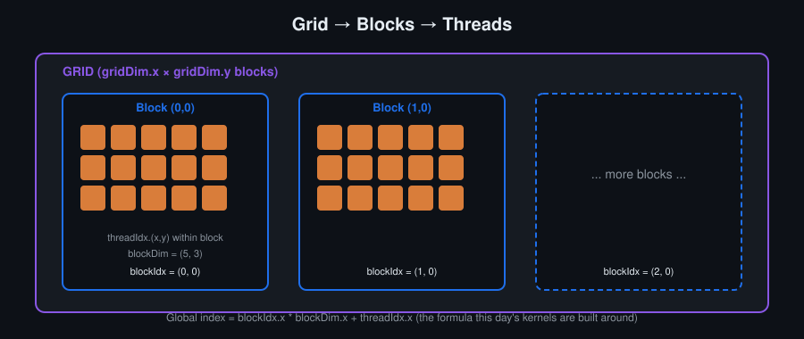

# Day 2: Thread Hierarchy, Indexing and Launch Configuration

## Objectives
- Divide work across threads, blocks and grids, for 1D and 2D data
- Write the global-index formula and explain why it has the shape it has
- Recognise coalesced and uncoalesced indexing, and index so that a warp's accesses are contiguous
- Choose a block size, and check the choice with `cudaOccupancyMaxActiveBlocksPerMultiprocessor`
- Write a grid-stride loop that is correct for any input size at a fixed launch configuration

## Key Concepts
- Threads, blocks, grids: structure and enumeration
- Launch configuration and kernel invocation
- 1D and 2D thread indexing
- Memory coalescing as a consequence of the index formula
- Occupancy and block-size choice (first pass; the hardware reason comes on Day 3 and Day 6)
- Grid-stride loops

## Definitions
**Thread** — The smallest unit of execution; identified within its block by `threadIdx`, within the grid by combining `threadIdx` with `blockIdx` and `blockDim`.

**Block** — A group of threads, up to `maxThreadsPerBlock`, that execute on the same SM and can cooperate through shared memory and `__syncthreads()`. A kernel launch creates a grid of blocks.

**Grid** — The full set of blocks launched by one kernel call, `<<<grid, block>>>`.

**Launch configuration** — The arguments of a kernel call: grid dimensions in blocks and block dimensions in threads, each up to three-dimensional, plus optional dynamic shared memory size and stream.

**`blockIdx`, `threadIdx`, `blockDim`, `gridDim`** — Built-in variables, available in device code without being declared or passed: the block's index in the grid, the thread's index in the block, the block's dimensions, the grid's dimensions. They are read-only, of type `uint3` (`dim3` for the dimensions), and each thread sees its own values.

Nothing in your code initialises them, and they are not ordinary variables sitting in memory:

| Variable | PTX | Set by |
|---|---|---|
| `threadIdx` | `%tid` | the hardware, when the SM creates the block's threads |
| `blockIdx` | `%ctaid` | the GPU's work distributor, when it assigns the block to an SM |
| `blockDim` | `%ntid` | the launch configuration — the host wrote it in `<<<grid, block>>>` |
| `gridDim` | `%nctaid` | the launch configuration, likewise |

So the first two are hardware identity and the second two are launch parameters, which is why the second two are the same for every thread in the grid. Reading one is an instruction, not a memory access. In the Day 1 example, the PTX

```ptx
mov.u32  %r3, %ntid.x;     // blockDim.x
mov.u32  %r4, %ctaid.x;    // blockIdx.x
mov.u32  %r5, %tid.x;      // threadIdx.x
```

becomes SASS in which `threadIdx` and `blockIdx` are read with a special-register instruction while `blockDim` is read straight out of the constant bank:

```sass
S2R  R6, SR_CTAID.X ;
S2R  R3, SR_TID.X ;
IMAD R6, R6, c[0x0][0x0], R3 ;   // c[0x0][0x0] is blockDim.x
```

**Resident blocks** — The blocks assigned to one SM at the same time. The count is the smallest of three limits: the hardware cap on blocks per SM, registers per SM divided by the block's register demand, and shared memory per SM divided by the block's shared memory demand.

**Occupancy** — How many warps are resident on an SM at once relative to the maximum it could hold. Limited by whichever resource runs out first: registers per thread, shared memory per block, or the thread-count cap. It is a means to **latency hiding**, not a goal — returns flatten past roughly 50 percent, and coarsened kernels trade it away deliberately.

**`cudaOccupancyMaxActiveBlocksPerMultiprocessor`** — The runtime call returning how many blocks of a given kernel and block size will be resident per SM, without running the kernel.

```c
cudaError_t cudaOccupancyMaxActiveBlocksPerMultiprocessor(
    int        *numBlocks,        // out: resident blocks per SM
    const void *func,             // the kernel symbol
    int         blockSize,        // threads per block you intend to launch with
    size_t      dynamicSMemSize); // dynamic shared memory per block in bytes, 0 if none
```

`func` is the kernel name itself; in C++ it decays to the function's address, so the call reads `cudaOccupancyMaxActiveBlocksPerMultiprocessor(&n, my_kernel, 256, 0)`. `dynamicSMemSize` is the third launch argument, `my_kernel<<<grid, block, smem>>>`, not the statically declared `__shared__` arrays — those the compiler already accounted for.

What comes back is a block count, not a percentage. Occupancy is derived:

```c
int n;
CUDA_CHECK(cudaOccupancyMaxActiveBlocksPerMultiprocessor(&n, my_kernel, blockSize, 0));

cudaDeviceProp p;
CUDA_CHECK(cudaGetDeviceProperties(&p, 0));

double occupancy = double(n * blockSize) / p.maxThreadsPerMultiProcessor;
```

The answer is computed from the compiled kernel's register count and shared memory request against this device's limits. Nothing is launched, so it is an upper bound on residency, not a measurement: it says how many blocks *could* be resident, not how busy the SM actually was. The measurement is `sm__warps_active.avg.pct_of_peak_sustained_active` in Nsight Compute, and the two differ whenever blocks finish at different times or the grid is too small to fill the device.

Two companions:

- `cudaOccupancyMaxActiveBlocksPerMultiprocessorWithFlags(..., unsigned int flags)` — same call with `cudaOccupancyDefault` for the normal behaviour, or `cudaOccupancyDisableCachingOverride` to suppress a platform-specific caching adjustment.
- `cudaOccupancyMaxPotentialBlockSize(&minGridSize, &blockSize, func, dynamicSMemSize, blockSizeLimit)` — the inverse question. Instead of scoring a block size you chose, it returns the block size with the best potential occupancy, and the smallest grid that reaches it. Useful as a starting point, not as an answer: best occupancy is not the same as fastest.

**Coalescing (memory coalescing)** — When the 32 lanes of a warp access consecutive addresses, the hardware serves them in a single 128-byte transaction instead of up to 32 separate ones. The property belongs to the warp, not the thread: what matters is the combined footprint of one instruction across all 32 lanes, not the pattern one thread traces over time.

**Grid-stride loop** — A launch pattern where a fixed number of threads each process several elements in a loop, striding by the total thread count, instead of sizing the grid to match the data. Correct for any input size without recomputing launch dimensions.

## How a block is placed
A block is assigned to one SM and stays there until it finishes. How many blocks fit on an SM at once is decided by three limits at the same time: registers per thread, shared memory per block, and the hardware cap on resident blocks. The lowest of the three wins. This is why block size is a hardware question, not a style question.

## Visual


A launch creates a grid of blocks, and each block is itself a 1D, 2D or 3D array of threads. `blockIdx` says which block a thread is in, `threadIdx` which slot inside that block. The formula in the diagram is the one reused in almost every kernel that follows.

## Animated


One formula, four concrete threads. It is always `blockIdx.x * blockDim.x + threadIdx.x`; only the block and thread values change.



Four threads cover sixteen elements in four iterations. Doubling the array to thirty-two gives eight iterations at the same launch configuration. This is the grid-stride loop of the hands-on task.

## Resources
- [CUDA C Programming Guide](https://docs.nvidia.com/cuda/pdf/CUDA_C_Programming_Guide.pdf) — 2. Programming Model · 5. Performance Guidelines
- CUDA C++ Best Practices Guide — Occupancy, Coalesced Access to Global Memory

## Hands-On Task
Vector addition, then the same kernel extended to 2D indexing over two grayscale images.

## Self-Learning
1. Implement 1D vector addition for several array sizes, with bounds checking for sizes that are not a multiple of the block size.
2. Extend to 2D indexing and add two grayscale images pixel by pixel.
3. Time block sizes of 32, 64, 128 and 256. Call `cudaOccupancyMaxActiveBlocksPerMultiprocessor` for each and note where the timings stop tracking the occupancy numbers.
4. Implement the same kernel as a grid-stride loop. Verify it is still correct after increasing `n` far beyond `blocks * threads` without changing the launch configuration.
5. Write two copy kernels, one indexed `blockIdx.x * blockDim.x + threadIdx.x` and one indexed `threadIdx.x * gridDim.x + blockIdx.x`. Both are correct. Measure both.
6. For your chosen block size, compute by hand how many blocks are resident per SM, then confirm with the occupancy API.

## Self-Check
No answers given.

1. What goes wrong in the global-index formula if you omit `blockDim.x`?
2. Why does a grid-stride loop stay correct when `n` doubles, while a one-thread-per-element kernel does not?
3. Both index formulas in task 5 produce correct output. What measurement tells you which one to keep?
4. You launch `<<<100, 256>>>` over 20,000 elements with bounds checking. How many threads do no work?

## Code Template
See [`template.cu`](template.cu).
