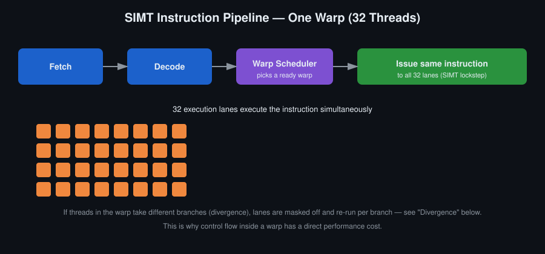
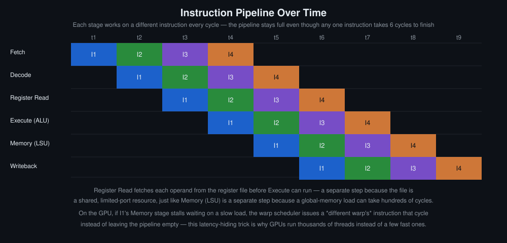

# Օր 3. SIMT կատարումը, warp-երը, divergence-ը և latency hiding-ը

## Նպատակներ
- Նկարագրել SIMT մոդելը. հրամանը մեկ անգամ է կարդացվում և վերծանվում, ապա ուղարկվում warp-ի բոլոր 32 lane-երին
- Նկարագրել հրամանների pipeline-ը և այն, թե ինչու են register read-ը և memory-ն առանձին փուլեր
- Նկարագրել, թե ինչպես է warp scheduler-ը թաքցնում latency-ն՝ հրամաններ ուղարկելով տարբեր resident warp-երից, և ինչու է GPU-ն այս եղանակով լուծում այն խնդիրը, որը CPU-ն լուծում է մեծ cache-երով
- Ճանաչել branch divergence-ը և խուսափել դրանից։ Նկարագրել, թե ինչու divergence-ի դեպքում ճյուղերը կատարվում են հերթով, ոչ թե զուգահեռ
- Կիրառել loop unrolling այնտեղ, որտեղ այն արագացնում է կոդը

## Հիմնական հասկացություններ
- SIMT և հրամանների pipeline՝ fetch, decode, warp scheduler։ Մեկ հրամանն ուղարկվում է բոլոր 32 lane-երին
- Ինչպես են warp-երը կազմվում `threadIdx`-ից։ Ինչու է block size-ը, որը 32-ի բազմապատիկ չէ, lane-եր վատնում
- Active, eligible (պատրաստ) և stalled warp-եր։ Ինչ է ցույց տալիս profiler-ի stall reason-ը
- Branch divergence և reconvergence
- Loop unrolling

## Սահմանումներ
**Warp** — Block-ի 32 thread-ից բաղկացած խումբ, որը hardware-ը պլանավորում և կատարում է որպես մեկ միավոր։ Warp-ի հրամանը միաժամանակ ուղարկվում է նրա բոլոր 32 thread-երին։ Warp մակարդակի intrinsic-ներն աշխատում են հենց այս միավորի վրա։

**SIMT (Single Instruction, Multiple Threads)** — NVIDIA-ի կատարման մոդելը. հրամանը մեկ անգամ է կարդացվում և վերծանվում, ապա միաժամանակ ուղարկվում warp-ի բոլոր 32 thread-երին։

**Հրամանների pipeline** — Փուլերը, որոնցով անցնում է հրամանը՝ fetch, decode, register read, execute, memory, writeback։ Ամեն պահի pipeline-ում կա մի քանի հրաման, ամեն փուլում՝ մեկը։

**Register file** — SM-ի ռեգիստրների ընդհանուր պահոցը, որից ռեգիստրներ են ստանում SM-ի բոլոր thread-երը։ Դրա չափը ֆիքսված է։ Որքան շատ ռեգիստր է օգտագործում մեկ thread-ը, այնքան քիչ warp կարող է resident լինել։

**Active, eligible և stalled warp** — Warp-ը active է (resident), երբ զբաղեցնում է SM-ի warp slot-երից մեկը։ Active warp-ը **eligible** է (պատրաստ է), երբ կարող է ուղարկել իր հաջորդ հրամանը։ Դրա համար պետք է երեք պայման. հրամանն արդեն վերծանված է, բոլոր արժեքները, որոնք հրամանը կարդում է, հասանելի են (օրինակ՝ այն load-ը, որից հրամանը կախված է, ավարտվել է), և հրամանը կատարող միավորը (FP32 pipe, load/store unit կամ tensor core) այդ ցիկլում ազատ է։ Եթե պայմաններից որևէ մեկը չի բավարարվում, warp-ը stalled է։ Ամեն ցիկլ scheduler-ն ընտրում է պատրաստ warp-երից մեկը և ուղարկում նրա հրամանը։

**Stall reason** — Profiler-ի դասակարգումը, որը ցույց է տալիս, թե ինչու warp-ը պատրաստ չէր։ NVIDIA-ն առանձնացնում է չորս խումբ. warp-ը սպասում է հրամանի կարդացմանը (instruction fetch), հիշողության գործողության ավարտին (memory dependency), նախորդ հրամանի արդյունքին (execution dependency) կամ սինխրոնացման barrier-ին։ Stall reason-ը ցույց է տալիս, թե կոդում ինչ պետք է ուղղել։

**Latency hiding** — GPU-ի արագագործության հիմնական միջոցը. երբ warp-ը կանգ է առնում, warp scheduler-ը նույն ցիկլում ուղարկում է մեկ այլ պատրաստ warp-ի հրամանը, և pipeline-ը պարապ չի մնում։ Այդ պատճառով GPU-ին պետք են շատ thread-եր, ոչ թե քիչ, բայց արագ thread-եր։

**Divergence (warp divergence)** — Իրավիճակ, երբ մեկ warp-ի thread-երը branch-ում տարբեր ճյուղեր են ընտրում։ Քանի որ warp-ի 32 thread-երն ունեն հրամանների մեկ հոսք, hardware-ը ճյուղերը կատարում է հերթով։ Ամեն ճյուղի ընթացքում մյուս ճյուղի lane-երն անջատված են։

**Reconvergence** — Divergent branch-ից հետո այն կետը, որտեղ warp-ի բոլոր lane-երը նորից կատարում են նույն հրամանը։ Volta-ից սկսած ամեն lane ունի իր program counter-ը, և branch-ի վերջում reconvergence-ն երաշխավորված չէ։ `__syncwarp`-ն այն ապահովում է բացահայտ։

**Loop unrolling** — Ցիկլի մարմինը կոդում կրկնվում է մի քանի անգամ, և ցիկլի կրկնությունների թիվը նվազում է։ Դա հեռացնում է ցիկլի պայմանի և ինդեքսի հրամանները և scheduler-ին տալիս է իրարից անկախ հրամաններ։ Կառավարվում է `#pragma unroll`-ով։

## Ֆունկցիաներ

```c
// Warp-ի barrier՝ mask-ում նշված lane-երը սպասում են միմյանց
void __syncwarp(unsigned mask = 0xFFFFFFFF);
```

## Ինչու է latency hiding-ը GPU-ի ճարտարապետության հիմքը
CPU-ն հիշողության latency-ն փոքրացնում է cache-երի խորը հիերարխիայով և speculation-ով։ GPU-ն հիմնականում դա չի անում. այն latency-ն հանդուրժում է։ Երբ warp-ը կանգ է առնում load-ի վրա, scheduler-ը նույն ցիկլում ուղարկում է մեկ այլ resident warp-ի հրամանը։ Այս մեկ սկզբունքով են բացատրվում occupancy-ն, block size-ի կարևորությունը, divergence-ի բարձր գինը և այն, թե ինչու է arithmetic intensity-ն որոշում արագագործությունը։ Դասընթացի մնացած թեմաները բխում են այստեղից։

## Պատկեր


Հրամանը մեկ անգամ է կարդացվում և վերծանվում, ապա միաժամանակ ուղարկվում warp-ի բոլոր 32 thread-երին։ Սրանով է պայմանավորված divergence-ի գինը. երբ lane-երը branch-ում տարբեր ճյուղեր են ընտրում, hardware-ն անջատում է lane-երի մի մասը և ճյուղերը կատարում հերթով։

## Անիմացիա


Նույն pipeline-ը ժամանակի առանցքով։ Register read-ը և memory-ն առանձին փուլեր են, որովհետև և՛ register file-ը, և՛ global memory-ն սահմանափակ ռեսուրսներ են, և դրանց դիմելն ունի իրական latency։ Երբ warp-ը կանգ է առնում memory փուլում, scheduler-ն այդ ցիկլում ուղարկում է մեկ այլ warp-ի հրաման, և փուլը պարապ չի մնում։



Երբ warp-ը դադարում է պատրաստ լինել, նրա փոխարեն հրաման է ուղարկում մեկ այլ resident warp։ Սա է latency hiding-ը։ Occupancy-ն ցույց է տալիս, թե քանի resident warp կա, որոնց միջև scheduler-ը կարող է ընտրել։


Ճյուղերը կատարվում են հերթով։ Divergence-ը warp-ի կատարումը դարձնում է հաջորդական և զուգահեռություն չի ավելացնում։

Քայլ առ քայլ տարբերակը՝ [`warp_animations.html`](warp_animations.html)։ Ֆայլը պետք է բացել browser-ով տեղական պատճենից, քանի որ GitHub-ը HTML-ը ցույց է տալիս որպես տեքստ և չի գործարկում։

## Գրականություն
- [CUDA C Programming Guide](https://docs.nvidia.com/cuda/archive/12.8.0/pdf/CUDA_C_Programming_Guide.pdf) — 7. Hardware Implementation · 8. Performance Guidelines
- [Nsight Compute Kernel Profiling Guide](https://docs.nvidia.com/nsight-compute/ProfilingGuide/index.html) — 2.3.1. Hardware Model։ Վերևում օգտագործված active, eligible և stalled վիճակները վերցված են այստեղից
- Oxford-ի CUDA դասընթացը, lecture 3՝ https://people.maths.ox.ac.uk/~gilesm/cuda/lecs/lec3.pdf
- Using CUDA warp-level primitives՝ https://developer.nvidia.com/blog/using-cuda-warp-level-primitives/
- Pipeline-ի և warp scheduling-ի գծապատկերները տե՛ս վերևի «Պատկեր» և «Անիմացիա» բաժիններում, ինտերակտիվ տարբերակը՝ [`warp_animations.html`](warp_animations.html)

## Լաբորատոր առաջադրանք
Վեկտորների գումարման kernel և դրա ժամանակի համեմատությունը CPU-ի վրա նույն գործողությունը կատարող ցիկլի հետ։ Ապա BGR պատկերը grayscale դարձնող kernel։

## Ինքնուրույն աշխատանք
1. Իրականացնել վեկտորների գումարումը GPU-ի վրա, չափել ժամանակը և համեմատել CPU-ի ցիկլի հետ։
2. Գրել kernel, որը BGR պատկերը դարձնում է grayscale (`gray = 0.114*B + 0.587*G + 0.299*R`)։
3. Դիտմամբ ավելացնել divergence (`if (threadIdx.x % 2 == 0)`) և չափել, թե որքան է դանդաղում kernel-ը divergence չունեցող տարբերակի համեմատ։
4. Կրկնել 3-րդ առաջադրանքը, բայց branch-ի պայմանը գրել `threadIdx.x / 32`-ով։ Նկարագրել, թե ինչու է արդյունքը տարբեր։
5. `#pragma unroll`-ը կիրառել փոքր, ֆիքսված թվով կրկնություններ ունեցող ցիկլի վրա։ Համեմատել ոչ միայն ժամանակը, այլև կոմպիլյատորի ստեղծած SASS-ը։

## Ինքնաստուգում
Պատասխանները տրված չեն։

1. Ինչու՞ է divergence-ը թանկ, եթե ամեն thread ի վերջո կատարում է միայն իր օգտակար աշխատանքը։
2. Ինչու՞ են register read-ը և memory-ն pipeline-ի առանձին փուլեր և միացված չեն execute փուլին։
3. Warp-ի կեսը կատարում է `if` ճյուղը, մյուս կեսը՝ `else` ճյուղը։ Որքա՞ն է այդ warp-ի կատարման ժամանակը՝ համեմատած divergence չունեցող warp-ի հետ, որը կատարում է նույն ծավալի աշխատանք։
4. 4-րդ առաջադրանքում branch-ի պայմանը `threadIdx.x / 32`-ն է, և branch-ը ժամանակ չի ավելացնում։ Ինչու՞։
5. Եթե latency hiding-ը կախված է այլ պատրաստ warp-երի առկայությունից, ի՞նչ է լինում այն kernel-ի հետ, որն այնքան շատ ռեգիստր է օգտագործում, որ SM-ում resident է միայն մեկ warp։

## Կոդի template
Տես [`template.cu`](template.cu)։
