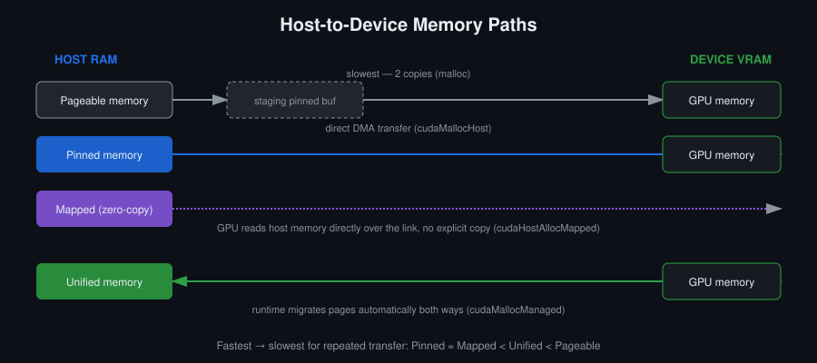

# Օր 4. Հիշողության տեսակները և host-device փոխանցումները

## Նպատակներ
- Տարբերել pageable, pinned, page-locked, mapped և unified հիշողությունը և նշել ամեն մեկի API-ն
- Նկարագրել, թե ինչու է pageable հիշողությունից փոխանցումն ավելի դանդաղ, քան pinned հիշողությունից, երբ բայթերի քանակը նույնն է
- Չափել փոխանցման bandwidth-ը և համեմատել այն device-ի հիշողության bandwidth-ի հետ
- Nsight Systems-ի timeline-ում տեսնել, թե ինչպես է ազդում հիշողության տեսակի ընտրությունը

## Հիմնական հասկացություններ
- Pageable հիշողություն (`malloc`), pinned հիշողություն (`cudaMallocHost`), արդեն հատկացված հիշողության page-lock (`cudaHostRegister`)
- Mapped (zero-copy) հիշողություն (`cudaHostAlloc`՝ `cudaHostAllocMapped` flag-ով)
- Unified հիշողություն (`cudaMallocManaged`, `__managed__`) և page migration
- DMA, և ինչու է այն պահանջում pinned էջեր
- PCIe-ի և NVLink-ի bandwidth-ը՝ համեմատած device-ի հիշողության bandwidth-ի հետ

## Սահմանումներ
**Pageable հիշողություն** — Սովորական host հիշողություն, որը հատկացվում է `malloc`-ով կամ `new`-ով։ Օպերացիոն համակարգը կարող է դրա էջերը տեղափոխել կամ swap անել, ուստի GPU-ն չի կարող ուղիղ դիմել դրանց։ Փոխանցման ժամանակ տվյալները նախ պատճենվում են driver-ի page-locked միջանկյալ բուֆեր։

**Page-locked հիշողություն** — Host-ի հիշողություն, որի էջերն օպերացիոն համակարգը չի կարող տեղափոխել կամ swap անել։

**Pinned հիշողություն** — `cudaMallocHost`-ով հատկացված page-locked host հիշողություն։ GPU-ն այն փոխանցում է DMA-ով՝ առանց միջանկյալ պատճենի։ Անհրաժեշտ է, որպեսզի `cudaMemcpyAsync`-ն իրոք ասինխրոն լինի։

**`cudaHostRegister`** — Արդեն հատկացված սովորական հիշողությունը դարձնում է page-locked՝ առանց վերահատկացման։ Դրանից հետո այն փոխանցվում է այնպես, ինչպես pinned հիշողությունը։ `cudaHostUnregister`-ը չեղարկում է այս գործողությունը։

**Mapped (zero-copy) հիշողություն** — Page-locked host հիշողություն, որն ունի նաև device-ի հասցե։ Հատկացվում է `cudaHostAlloc`-ով՝ `cudaHostAllocMapped` flag-ով։ Kernel-ն այն կարդում և գրում է ուղիղ host-device կապով, առանց բացահայտ պատճենի, բայց ամեն դիմում կրում է կապի latency-ն։

**Unified հիշողություն** — Մեկ հատկացում (`cudaMallocManaged`), որը հասցեագրելի է և՛ host-ից, և՛ device-ից։ Driver-ն էջերը տեղափոխում է նրանց միջև, երբ դրանք պահանջվում են։

**Page migration** — Unified հիշողության էջի տեղափոխումն այն պրոցեսորի հիշողություն, որը դիմել է էջին և ստացել page fault։ Էջերի կրկնվող տեղափոխումն երկու ուղղությամբ unified հիշողության դանդաղության սովորական պատճառն է։ Տեղափոխումը կառավարվում է `cudaMemPrefetchAsync`-ով և `cudaMemAdvise`-ով։

**DMA (Direct Memory Access)** — Փոխանցում, որը կատարում է copy engine-ը, և CPU-ն չի մասնակցում տվյալների տեղափոխմանը։ DMA-ն պահանջում է, որ host-ի էջերը page-locked լինեն։ Հենց դրա համար են pinned հիշողությունից փոխանցումներն ավելի արագ։

**PCIe** — Bus, որը համակարգերի մեծ մասում միացնում է host-ը և device-ը։ Դրա bandwidth-ն առնվազն մեկ կարգով ցածր է device-ի հիշողության bandwidth-ից։

**NVLink** — NVIDIA-ի ուղիղ կապը GPU-ների միջև, որոշ համակարգերում նաև CPU-ի և GPU-ի միջև։ Դրա bandwidth-ը մի քանի անգամ մեծ է PCIe-ի bandwidth-ից։

**Հիշողության bandwidth** — SM-ների և device-ի հիշողության միջև վայրկյանում փոխանցվող բայթերի քանակը։ Տեսական peak-ը հավասար է bus width-ի, հիշողության clock-ի և մեկ clock-ում փոխանցումների քանակի արտադրյալին։ Հասած bandwidth-ն այն արժեքն է, որին kernel-ն իրականում հասնում է։

## Ֆունկցիաներ

```c
// Pinned հիշողության հատկացում և ազատում host-ում
cudaError_t cudaMallocHost(void **ptr, size_t size);
cudaError_t cudaFreeHost(void *ptr);

// Արդեն հատկացված հիշողությունը դարձնում է page-locked և չեղարկում դա
cudaError_t cudaHostRegister(void *ptr, size_t size, unsigned int flags);
cudaError_t cudaHostUnregister(void *ptr);

// Pinned հիշողություն flags-ով։ cudaHostAllocMapped flag-ը տալիս է mapped (zero-copy) հիշողություն
cudaError_t cudaHostAlloc(void **pHost, size_t size, unsigned int flags);

// Unified հիշողության հատկացում
cudaError_t cudaMallocManaged(void **devPtr, size_t size, unsigned int flags = cudaMemAttachGlobal);

// Unified հիշողության էջերը նախապես տեղափոխում է dstDevice-ի հիշողություն
cudaError_t cudaMemPrefetchAsync(const void *devPtr, size_t count, int dstDevice, cudaStream_t stream = 0);

// Driver-ին հայտնում է, թե ինչպես են օգտագործվելու unified հիշողության էջերը
cudaError_t cudaMemAdvise(const void *devPtr, size_t count, enum cudaMemoryAdvise advice, int device);

// Սինխրոն և ասինխրոն պատճենում
cudaError_t cudaMemcpy(void *dst, const void *src, size_t count, enum cudaMemcpyKind kind);
cudaError_t cudaMemcpyAsync(void *dst, const void *src, size_t count, enum cudaMemcpyKind kind,
                            cudaStream_t stream = 0);
```

## Ամենակարևոր համեմատությունը
Device-ի հիշողության bandwidth-ը հարյուրավոր GB/s-ից մինչև մի քանի TB/s է։ PCIe-ի bandwidth-ն առնվազն մեկ կարգով ցածր է։ Եթե kernel-ը փոխանցում է մուտքային տվյալները, դրանց վրա կատարում է ընդամենը մեկ հաշվարկ և արդյունքը հետ է փոխանցում, ծրագրի ժամանակը որոշում է կապը, ոչ թե GPU-ն։ Երբ GPU-ի վրա տեղափոխված կոդը չի արագանում, առաջին հերթին պետք է ստուգել սա։ Հենց այս խնդրի համար են նախատեսված stream-երը (Օր 8)։

## Պատկեր


Հիշողության ամեն տեսակ տարբեր կերպ է պատասխանում նույն հարցին. ինչպես են տվյալները host-ի RAM-ից հասնում device-ի VRAM։ Pageable հիշողությունը պահանջում է թաքնված միջանկյալ պատճեն, pinned-ը՝ ոչ։ Mapped հիշողությունն ընդհանրապես պատճեն չի պահանջում, բայց ամեն դիմում կրում է կապի latency-ն։ Unified հիշողության դեպքում որոշումը կայացնում է runtime-ը։

## Գրականություն
- [CUDA C Programming Guide](https://docs.nvidia.com/cuda/pdf/CUDA_C_Programming_Guide.pdf) — 3.2.2. Device Memory · 3.2.6. Page-Locked Host Memory · 19. Unified Memory Programming
- CUDA C++ Best Practices Guide — Memory Optimizations, Pinned Memory
- Nsight Systems — User Guide

## Լաբորատոր առաջադրանք
Վեկտորների գումարման ծրագիրը (Օր 2, Օր 3) փոխել այնպես, որ այն օգտագործի pinned հիշողություն, և երկու տարբերակը համեմատել Nsight Systems-ում։

## Ինքնուրույն աշխատանք
1. Չափել `cudaMemcpy`-ի ժամանակը pageable և pinned host հիշողության դեպքում՝ փոխանցման մի քանի չափի համար։ Կառուցել bandwidth-ի կախվածությունը փոխանցման չափից։
2. Արդեն հատկացված pageable բուֆերը դարձնել page-locked `cudaHostRegister`-ով՝ նոր pinned հիշողություն հատկացնելու փոխարեն, և համեմատել արդյունքները։
3. Վեկտորների գումարումը վերագրել `cudaMallocManaged`-ով և համեմատել և՛ կոդի բարդությունը, և՛ արագագործությունը։
4. Երեք տարբերակն էլ profile անել Nsight Systems-ով և համեմատել փոխանցումների timeline-ները։
5. Հաշվել վեկտորների գումարման arithmetic intensity-ն և Օր 1-ում ստացած թվերով որոշել, թե ինչն է սահմանափակում արագությունը՝ kernel-ը, թե փոխանցումը։

## Ինքնաստուգում
Պատասխանները տրված չեն։

1. Ինչու՞ է pageable հիշողությունից device պատճենելն ավելի դանդաղ, քան pinned հիշողությունից, եթե փոխանցվում է նույն քանակի բայթ։
2. Ի՞նչ գին ունի համակարգի համար host-ի մեծ ծավալի հիշողություն pin անելը։
3. Ե՞րբ է zero-copy հիշողությունն ավելի արագ, քան տվյալները նախ device պատճենելը։
4. Unified հիշողությունը կոդից հանում է բացահայտ պատճենը։ Փոխանցումն էլ է վերանո՞ւմ։

## Կոդի template
Տես [`template.cu`](template.cu)։
