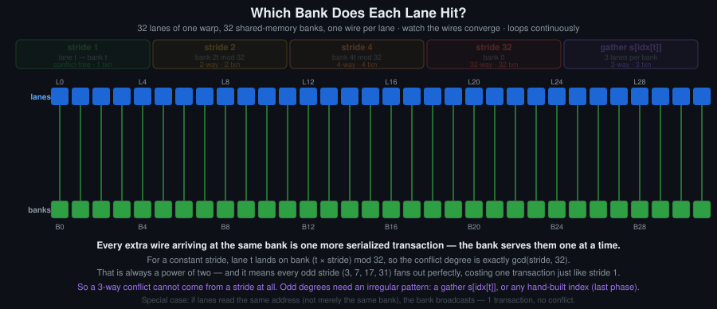

# Day 5: Shared Memory and Bank Conflicts

## Objectives
- Explain shared memory banking and how a conflict arises
- Synchronise access to shared memory correctly, and state what `__syncthreads()` does and does not guarantee
- Distinguish global, shared, constant and pitched memory and choose between them
- Implement a tiled 2D filter and remove its bank conflicts

## Key Concepts
- 32 banks; conflict-free access, broadcast, and n-way conflicts
- `__syncthreads()`: what it guarantees, and its cost in occupancy terms
- Shared memory and L1 share the same physical SRAM; the carveout is configurable
- Constant memory and the broadcast path
- Pitched memory and why `step` differs from `cols * elemSize()`
- Tiling as a reduction in global memory traffic

## Definitions
**Shared memory** — On-chip memory allocated per block and shared by its threads, with latency close to a register access and lifetime equal to the block's. Declared `__shared__`, statically or as the dynamic third launch argument.

**Bank** — One of the 32 equal divisions of shared memory. Successive 32-bit words fall in successive banks, and each bank serves one word per cycle.

**Bank conflict** — When several threads of a warp access shared memory addresses mapping to the same bank in one transaction, those accesses are serialised instead of served in parallel. Fixed by padding (this day) or by index swizzling (Day 6).

**Broadcast** — When every lane of a warp reads the same shared memory word, the hardware serves them in one transaction. This is not a conflict.

**N-way conflict** — When N lanes of a warp address different words in the same bank, the access is split into N transactions.

**`__syncthreads()`** — A barrier for the block: no thread passes it until every thread of the block reaches it, and shared and global writes made before it are visible to the block after it. Every thread of the block must reach it, so placing it inside divergent control flow is undefined behaviour.

**Barrier** — A point all participating threads must reach before any may continue. `__syncthreads()` is the block-wide barrier, `__syncwarp` the warp-wide one.

**Constant memory** — A 64 KB read-only region declared `__constant__`, cached per SM. When all lanes of a warp read the same address it is served as one broadcast; divergent addresses are serialised.

**Tiling** — Staging a block of data in shared memory once and reading it many times on chip, cutting global traffic by roughly the reuse factor. The technique behind tiled matrix multiply and every stencil and filter kernel in this course.

**Halo** — The border elements a tile needs but does not own: for a filter of radius R, the R rows and columns around the tile. They must be loaded into shared memory along with the tile.

**Pitch** — The actual byte stride between rows of a 2D allocation (`cudaMallocPitch`), normally larger than `width * elementSize` because of alignment padding. Kernels touching pitched memory must index rows by pitch, not by width.

## Visual

Shared memory is split into 32 banks so that a warp can be served in one transaction, provided each lane hits a different bank. A stride that is a multiple of 32 — which is what indexing by a tile width of 32 produces — collapses onto one bank and serialises. Padding the row stride by one element is the standard fix, and it is what `tiled_filter` in [`template.cu`](template.cu) is set up for.

For the extension task. The naive kernel re-reads the same rows and columns of A and B from global memory once per output element. The tiled version loads one tile of each into shared memory per block, and every thread in the block reuses it. Same tiling as the filter, applied to matrix multiply.

## Animated

One wire per lane, showing which bank it actually lands on. Every extra wire arriving at the same bank is one more serialised transaction: a bank serves one word per cycle, so the whole warp waits for the busiest one.

The rule behind it: lane `t` reads word `t x stride`, which lives in bank `(t x stride) mod 32`, so the conflict degree is `gcd(stride, 32)`. Two consequences:

- Every odd stride is conflict-free. Strides 3, 7, 17 and 31 cost one transaction, the same as stride 1. Only strides sharing a factor of two with 32 cost more, and each extra factor doubles the cost. Padding a tile to `[TILE][TILE+1]` forces an even row stride to become odd; that is all it does.
- From a constant stride the degree is always a power of two, since `gcd(s, 32)` divides 32. There is no three-way conflict from a constant stride. Odd degrees need an irregular pattern — an indirect gather `s[idx[t]]`, a lookup table, a compaction — which is the fifth phase in the diagram. The practical difference is in how they are diagnosed: for a regular tiled kernel, `gcd(row_stride, 32)` settles it on paper; for a gather, only the profiler does (`ncu --metrics l1tex__data_bank_conflicts_pipe_lsu_mem_shared`).

A configurable version — any stride from 1 to 33, any gather degree, per-lane wire tracing, and the transpose read and write phases under plain, padded and swizzled layouts — is in [`bank_conflict_animations.html`](bank_conflict_animations.html). Open it locally in a browser.

## Resources
- [CUDA C Programming Guide](https://docs.nvidia.com/cuda/pdf/CUDA_C_Programming_Guide.pdf) — 3.2.4. Shared Memory
- CUDA C++ Best Practices Guide — Shared Memory
- Bank conflict diagrams: see `Visual` and `Animated` above; stride explorer in [`bank_conflict_animations.html`](bank_conflict_animations.html)

## Hands-On Task
A shared-memory tiled 2D filter over a real image, then a Sobel filter.

## Self-Learning
1. Implement a tile-based 2D convolution (start with a box blur) with a halo region.
2. Create a shared-memory access pattern with bank conflicts on purpose, measure the cost, then remove it with padding.
3. Implement a 2D Sobel filter using shared memory.
4. For your tile, compute by hand how many bank conflicts a warp incurs, then confirm the number in Nsight Compute.
5. Vary the tile size and record the point at which shared memory per block, not arithmetic, limits occupancy.

## Self-Check
No answers given.

1. Why do 32 threads reading `tile[threadIdx.x][k]` for a fixed `k` collide on one bank?
2. A warp accesses shared memory with stride 3. How many transactions does that cost, and why is the answer not 3?
3. What does `__syncthreads()` explicitly not guarantee?
4. Padding a tile by one column wastes shared memory. Why is it usually still the right trade?

## Code Template
See [`template.cu`](template.cu).
