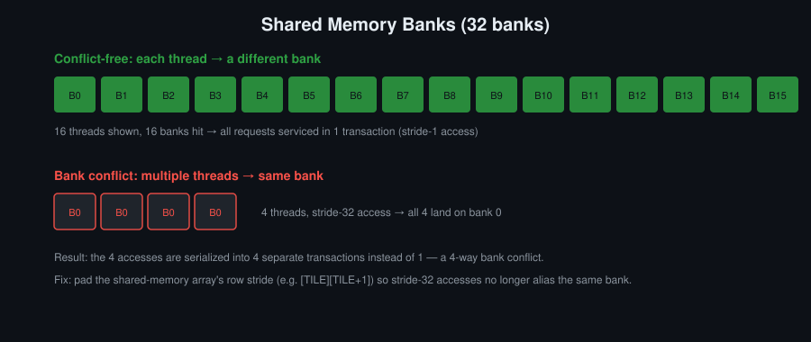
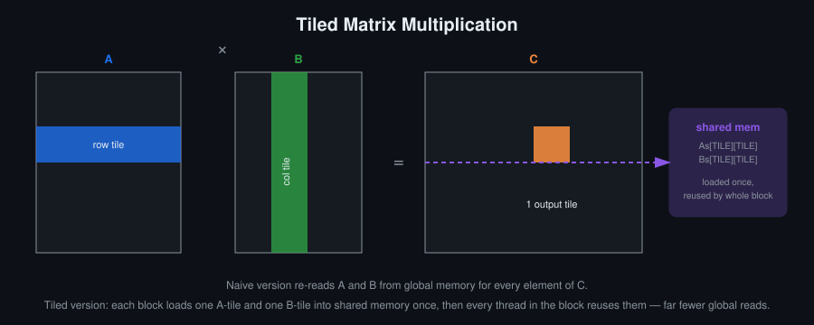

# Օր 5. Shared memory-ն և bank conflict-ները

## Նպատակներ
- Նկարագրել, թե ինչպես է shared memory-ն բաժանված bank-երի և ինչպես է առաջանում bank conflict-ը
- Ճիշտ սինխրոնացնել shared memory-ին դիմումները և նկարագրել, թե ինչ է երաշխավորում `__syncthreads()`-ը և ինչ՝ ոչ
- Տարբերել global, shared, constant և pitched հիշողությունը և ընտրել դրանցից համապատասխանը
- Իրականացնել tiled 2D ֆիլտր և հեռացնել դրա bank conflict-ները

## Հիմնական հասկացություններ
- 32 bank. դիմում առանց conflict-ի, broadcast, N-way conflict
- `__syncthreads()`՝ ինչ է երաշխավորում և ինչ գին ունի occupancy-ի տեսանկյունից
- Shared memory-ն և L1-ն օգտագործում են նույն ֆիզիկական SRAM-ը
- Constant memory և դրա broadcast մեխանիզմը
- Pitched հիշողություն, և ինչու է pitch-ը տարբերվում `width * sizeof(T)`-ից
- Tiling՝ global memory-ի տրաֆիկը նվազեցնելու միջոց

## Սահմանումներ
**Shared memory** — Չիպի վրա գտնվող հիշողություն, որը հատկացվում է ամեն block-ի համար և հասանելի է block-ի բոլոր thread-երին։ Դրա latency-ն շատ ավելի փոքր է, քան global memory-ինը, իսկ կյանքի տևողությունը համընկնում է block-ի կյանքի տևողությանը։ Հայտարարվում է `__shared__`-ով՝ ստատիկ, կամ չափը տրվում է launch-ի երրորդ արգումենտով՝ դինամիկ։

**Bank** — Shared memory-ի 32 հավասար մասերից մեկը։ Հաջորդական 32-բիթանոց բառերը գտնվում են հաջորդական bank-երում, և ամեն bank մեկ ցիկլում սպասարկում է մեկ բառ։

**Bank conflict** — Իրավիճակ, երբ warp-ի մի քանի thread մեկ դիմումում կարդում կամ գրում են նույն bank-ի տարբեր բառեր։ Այդ դիմումները սպասարկվում են հերթով, ոչ թե զուգահեռ։ Լուծվում է padding-ով (այս օրը) կամ ինդեքսների swizzling-ով (Օր 6)։

**Broadcast** — Երբ warp-ի մի քանի կամ բոլոր lane-երը կարդում են shared memory-ի նույն բառը, hardware-ն այն տալիս է բոլորին մեկ transaction-ով։ Սա conflict չէ։

**N-way conflict** — Երբ warp-ի N lane դիմում են նույն bank-ի N տարբեր բառի, դիմումը բաժանվում է N transaction-ի։

**`__syncthreads()`** — Block-ի barrier։ Ոչ մի thread չի անցնում այս կետը, քանի դեռ block-ի բոլոր thread-երը չեն հասել դրան։ Մինչև barrier-ը կատարված shared և global memory-ի գրառումները barrier-ից հետո տեսանելի են block-ի բոլոր thread-երին։ Քանի որ block-ի ամեն thread պետք է հասնի barrier-ին, այն divergent control flow-ի ներսում դնելը undefined behaviour է։

**Barrier** — Ծրագրի կետ, որին պետք է հասնեն բոլոր մասնակից thread-երը, մինչև դրանցից որևէ մեկը շարունակի։ `__syncthreads()`-ը block-ի barrier-ն է, `__syncwarp`-ը՝ warp-ի barrier-ը։

**Constant memory** — 64 ԿԲ ծավալով տիրույթ, որը նախատեսված է միայն կարդալու համար։ Հայտարարվում է `__constant__`-ով և cache է արվում ամեն SM-ում։ Երբ warp-ի բոլոր lane-երը կարդում են նույն հասցեն, դիմումը սպասարկվում է մեկ broadcast-ով, իսկ տարբեր հասցեները սպասարկվում են հերթով։

**Tiling** — Տվյալների մի հատվածը մեկ անգամ բեռնել shared memory և այնտեղից կարդալ շատ անգամ։ Global memory-ի տրաֆիկը նվազում է մոտավորապես այնքան անգամ, քանի անգամ կրկին օգտագործվում է ամեն տարրը։ Այս տեխնիկան ընկած է tiled matrix multiply-ի և այս դասընթացի բոլոր stencil և ֆիլտր kernel-ների հիմքում։

**Halo** — Եզրային տարրեր, որոնք անհրաժեշտ են tile-ը մշակելու համար, բայց պատկանում են հարևան tile-երին։ R շառավղով ֆիլտրի դեպքում դրանք tile-ի ամեն կողմից R տող կամ սյուն են։ Halo-ն պետք է բեռնվի shared memory tile-ի հետ միասին։

**Pitch** — 2D հատկացման երկու հարևան տողերի սկզբների միջև հեռավորությունը բայթերով (`cudaMallocPitch`)։ Սովորաբար այն մեծ է `width * elementSize`-ից, քանի որ տողերը լրացվում են հավասարեցման (alignment) համար։ Pitched հիշողության հետ աշխատող kernel-ը տողի հասցեն պետք է հաշվի pitch-ով, ոչ թե width-ով։

## Ֆունկցիաներ

```c
// Հատկացնում է height տող՝ ամեն մեկը width բայթ։ Տողերի իրական քայլը գրվում է *pitch-ում
cudaError_t cudaMallocPitch(void **devPtr, size_t *pitch, size_t width, size_t height);

// Պատճենում է height տող՝ ամեն տողից width բայթ։ dpitch-ը և spitch-ը dst-ի և src-ի տողերի քայլերն են
cudaError_t cudaMemcpy2D(void *dst, size_t dpitch, const void *src, size_t spitch,
                         size_t width, size_t height, enum cudaMemcpyKind kind);

// Block-ի և warp-ի barrier-ներ
void __syncthreads(void);
void __syncwarp(unsigned mask = 0xFFFFFFFF);
```

## Պատկեր


Shared memory-ն բաժանված է 32 bank-ի, որպեսզի warp-ի դիմումը սպասարկվի մեկ transaction-ով, եթե ամեն lane դիմում է այլ bank-ի։ Եթե stride-ը 32-ի բազմապատիկ է (օրինակ՝ 32 լայնությամբ tile-ի սյունը կարդալիս), բոլոր դիմումներն ընկնում են մեկ bank և սպասարկվում են հերթով։ Սովորական լուծումը տողի երկարությունը մեկ տարրով մեծացնելն է (padding), և [`template.cu`](template.cu)-ի `tiled_filter`-ը նախատեսված է հենց դրա համար։



Այս պատկերն ընդլայնված առաջադրանքի համար է։ Naive kernel-ը A-ի և B-ի նույն տողերն ու սյուները global memory-ից կարդում է նորից՝ ամեն ելքային տարրի համար։ Tiled տարբերակում ամեն block-ը մեկ անգամ բեռնում է tile-երը shared memory, և block-ի բոլոր thread-երը կրկին օգտագործում են դրանք։ Սա նույն tiling-ն է, ինչ ֆիլտրում, կիրառված matrix multiply-ի վրա։

## Անիմացիա


Ամեն lane-ի գիծը ցույց է տալիս, թե որ bank-ին է այն դիմում։ Նույն bank-ին հասնող ամեն լրացուցիչ գիծ ևս մեկ հաջորդական transaction է։ Bank-ը մեկ ցիկլում սպասարկում է մեկ բառ, ուստի ամբողջ warp-ը սպասում է ամենաբեռնված bank-ին։

Կանոնը. lane `t`-ն կարդում է `t x stride` համարի բառը, որը գտնվում է `(t x stride) mod 32` bank-ում։ Հետևաբար conflict-ի աստիճանը `gcd(stride, 32)` է։ Սրանից բխում է երկու հետևանք.

- Ցանկացած կենտ stride առանց conflict-ի է։ Stride 3-ով, 7-ով, 17-ով և 31-ով դիմումները պահանջում են մեկ transaction, ինչպես stride 1-ը։ Թանկ են միայն զույգ stride-երը, և stride-ի ամեն լրացուցիչ 2 արտադրիչ կրկնապատկում է գինը (մինչև 32)։ Tile-ը `[TILE][TILE+1]` դարձնելը զույգ տողային քայլը դարձնում է կենտ և ուրիշ ոչինչ չի փոխում։
- Հաստատուն stride-ի դեպքում conflict-ի աստիճանը միշտ 2-ի աստիճան է, քանի որ `gcd(s, 32)`-ը 32-ի բաժանարար է։ Այսինքն՝ հաստատուն stride-ով եռակի conflict չի ստացվում։ Եռակի և այլ կենտ աստիճանի conflict-ի համար անհրաժեշտ է անկանոն դիմում, օրինակ՝ անուղղակի gather `s[idx[t]]`, lookup table կամ compaction։ Սա գծապատկերի հինգերորդ դեպքն է։ Գործնական տարբերությունն ախտորոշման մեջ է. կանոնավոր tiled kernel-ի դեպքում `gcd(row_stride, 32)`-ը հարցին պատասխանում է թղթի վրա, իսկ gather-ի դեպքում պատասխանը կտա միայն profiler-ը (`ncu --metrics l1tex__data_bank_conflicts_pipe_lsu_mem_shared`)։

Կարգավորելի տարբերակը՝ [`bank_conflict_animations.html`](bank_conflict_animations.html)։ Այնտեղ կարելի է ընտրել ցանկացած stride 1-ից 33, gather-ի ցանկացած աստիճան, հետևել ամեն lane-ի գծին և դիտել transpose-ի կարդալու և գրելու փուլերը plain, padded և swizzled դասավորությունների դեպքում։ Ֆայլը պետք է բացել browser-ով տեղական պատճենից։

## Գրականություն
- [CUDA C Programming Guide](https://docs.nvidia.com/cuda/archive/12.8.0/pdf/CUDA_C_Programming_Guide.pdf) — 6.2.4. Shared Memory
- CUDA C++ Best Practices Guide — Shared Memory
- Bank conflict-ի գծապատկերները տե՛ս վերևի «Պատկեր» և «Անիմացիա» բաժիններում, stride-երի ինտերակտիվ հետազոտիչը՝ [`bank_conflict_animations.html`](bank_conflict_animations.html)

## Լաբորատոր առաջադրանք
Tiled 2D ֆիլտր shared memory-ով՝ իրական պատկերի վրա, ապա Sobel ֆիլտր։

## Ինքնուրույն աշխատանք
1. Իրականացնել tile-երի վրա հիմնված 2D convolution halo-ով (սկսել box blur-ից)։
2. Դիտմամբ գրել shared memory-ի դիմում bank conflict-ներով, չափել դրանց գինը, ապա հեռացնել conflict-ները padding-ով։
3. Իրականացնել 2D Sobel ֆիլտր shared memory-ով։
4. Ձեր tile-ի համար ձեռքով հաշվել, թե քանի bank conflict է ունենում warp-ը, ապա ստուգել թիվը Nsight Compute-ում։
5. Փոխել tile-ի չափը և գտնել այն չափը, որից սկսած occupancy-ն սահմանափակվում է մեկ block-ի shared memory-ի ծավալով։

## Ինքնաստուգում
Պատասխանները տրված չեն։

1. Tile-ի լայնությունը 32 է։ Ֆիքսված `k`-ի դեպքում `tile[threadIdx.x][k]` կարդացող 32 thread-երը դիմում են նույն bank-ին։ Ինչու՞։
2. Warp-ը shared memory-ին դիմում է stride 3-ով։ Քանի՞ transaction է պահանջում այդ դիմումը, և ինչու՞ պատասխանը 3 չէ։
3. Ի՞նչ չի երաշխավորում `__syncthreads()`-ը։
4. Tile-ին մեկ սյուն ավելացնելը (padding) shared memory է վատնում։ Ինչու՞ է դա սովորաբար արդարացված։

## Կոդի template
Տես [`template.cu`](template.cu)։
