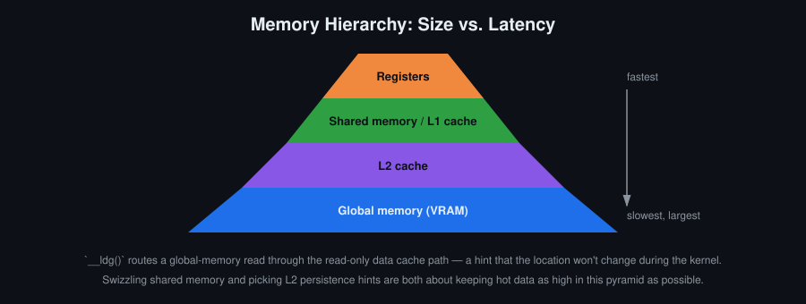
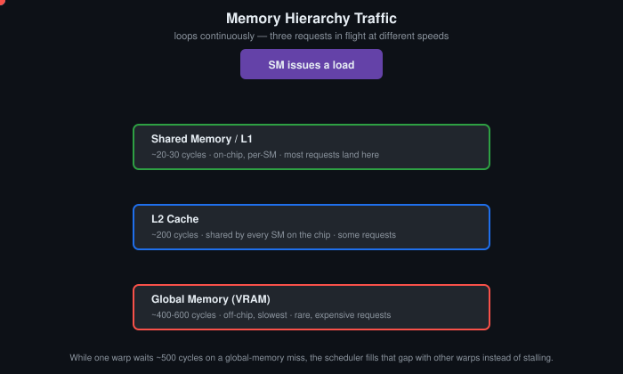
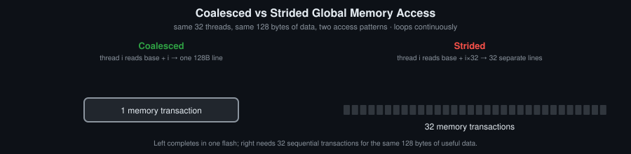

# Օր 6. Coalescing-ը, cache-երը և bandwidth-ը

## Նպատակներ
- Նկարագրել coalescing-ը sector-ների և cache line-երի միջոցով, ոչ թե որպես կոդ գրելու կանոն
- Նկարագրել L1-ի և L2-ի աշխատանքը, այդ թվում՝ թե որտեղ են կատարվում atomic-ները
- Օգտագործել `__ldg`-ն և հրամանի մակարդակի cache operator-ները և նկարագրել, թե երբ է արդարացված դրանցից յուրաքանչյուրը
- Thread coarsening-ով բաշխել մեկ thread-ի հաստատուն ծախսերը և նկարագրել, թե դա ինչ գին ունի
- Kernel-ի արագությունն արտահայտել տեսական peak bandwidth-ի տոկոսով և դրանով որոշել, թե երբ է պետք դադարեցնել օպտիմալացումը

## Հիմնական հասկացություններ
- Cache line-ը 128 բայթ է, sector-ը՝ 32 բայթ։ Warp-ի դիմումը վերածվում է որոշակի քանակի sector-ների
- Coalescing՝ մեկ request-ի sector-ների քանակի նվազեցում
- L1-ը ամեն SM-ում է, L2-ը՝ ընդհանուր ամբողջ չիպի համար։ Global memory-ի atomic-ները կատարվում են L2-ում
- LRU-ին մոտ դուրս մղման կանոն և cache operator-ներ՝ `__ldg`, `__ldcs`, `__stcs`, `__ldlu`
- Thread coarsening-ի և occupancy-ի փոխզիջումը
- Memory-bound և compute-bound kernel-ներ, հասած bandwidth-ը՝ որպես peak-ի մաս

## Սահմանումներ
**Cache line** — L1-ում տեղ հատկացնելու 128-բայթանոց միավորը։

**Sector** — 32-բայթանոց միավոր, որով հիշողությունից տվյալներն իրականում կարդացվում և տեղափոխվում են։ Warp-ի դիմումը հաշվվում է sector-ներով, և չորս sector-ը կազմում են մեկ cache line։ Coalescing-ը մեկ request-ի sector-ների քանակի նվազեցումն է։

**L1** — Ամեն SM-ի cache-ը։ Ֆիզիկապես այն նույն SRAM-ն է, ինչ shared memory-ն։

**L2** — Ամբողջ չիպի cache-ը, որը գտնվում է device-ի հիշողության առջև և ընդհանուր է բոլոր SM-ների համար։ Global memory-ի atomic-ները կատարվում են այստեղ։

**Cache operator** — Հրամանի մակարդակի ցուցում այն մասին, թե load-ը կամ store-ը ինչպես օգտագործի cache-երը։ `__ldg`՝ load միայն կարդալու համար նախատեսված cache-ի ճանապարհով, `__ldcs`՝ streaming load, որի տողը cache-ից դուրս է մղվում առաջինը, `__stcs`՝ streaming store, `__ldlu`՝ վերջին օգտագործման load, որից հետո տողը հեռացվում է cache-ից։

**LRU** — Least recently used. Դուրս մղման կանոն, որով cache-ից հեռացվում է ամենավաղուց չօգտագործված տողը։ Իրական cache-երն այս կանոնին հետևում են մոտավորապես։

**Thread coarsening** — Ամեն thread մշակում է մեկի փոխարեն մի քանի ելքային տարր։ Արդյունքում մեկ thread-ի հաստատուն ծախսերը (ինդեքսի հաշվարկ, սահմանների ստուգում, shared memory-ի tile-ի բեռնում) կատարվում են մեկ անգամ և բաշխվում են մի քանի տարրի վրա։ Grid-stride loop-ը coarsening-ը գրելու այն ձևն է, որը չի խախտում coalescing-ը։ Coarsening-ը նվազեցնում է occupancy-ն, ուստի արդյունքը պետք է չափել։

**Swizzling** — Shared memory-ի ինդեքսի վերադասավորում, օրինակ՝ `tile[row][col ^ row]`, որպեսզի միևնույն տրամաբանական սյունը ամեն տողում ընկնի այլ ֆիզիկական bank-ում։ Այն հեռացնում է bank conflict-ները՝ առանց լրացուցիչ սյան։

**Տեսական peak bandwidth** — Bus width-ի, հիշողության clock-ի և մեկ clock-ում փոխանցումների քանակի արտադրյալը՝ հաշված Օր 1-ում ստացած թվերով։ Սա այն վերին սահմանն է, որի հետ համեմատվում է kernel-ը։

**Հասած bandwidth** — Kernel-ի իրականում տեղափոխած բայթերը՝ բաժանած նրա կատարման ժամանակին։ Սովորաբար արտահայտվում է տեսական peak-ի տոկոսով։

**Arithmetic intensity** — Կատարված FLOP-երի քանակը հիշողության տրաֆիկի մեկ բայթի հաշվով։ Այն որոշում է, թե roofline-ի որ մասում է kernel-ը։ Ցածր intensity-ն նշանակում է memory-bound (kernel-ների մեծ մասն այդպիսին է), բարձրը՝ compute-bound։ Tiling-ը բարձրացնում է intensity-ն՝ առանց թվաբանական գործողությունները փոխելու։

**Compute-bound և memory-bound** — Ցույց է տալիս, թե ինչն է սահմանափակում kernel-ի արագությունը՝ հրամանների throughput-ը, թե հիշողության bandwidth-ը։ Դրանից է կախված, թե որ օպտիմալացումները կարող են օգնել։

**Roofline** — Հասանելի առավելագույն արագագործության գրաֆիկը՝ կախված arithmetic intensity-ից։ Այն բաղկացած է bandwidth-ի թեք սահմանից և compute-ի հորիզոնական սահմանից։ Kernel-ի դիրքը գրաֆիկի վրա ցույց է տալիս, թե որ օպտիմալացումը կարող է օգնել՝ հիշողության, թե հրամանների։

## Ֆունկցիաներ

```c
// Կարդում է միայն կարդալու համար նախատեսված cache-ի ճանապարհով
unsigned char __ldg(const unsigned char *ptr);
float         __ldg(const float *ptr);

// Streaming load՝ տողը cache-ից դուրս է մղվում առաջինը
unsigned char __ldcs(const unsigned char *ptr);
float         __ldcs(const float *ptr);

// Վերջին օգտագործման load՝ դրանից հետո տողը հեռացվում է cache-ից
unsigned char __ldlu(const unsigned char *ptr);
float         __ldlu(const float *ptr);

// Streaming store
void __stcs(unsigned char *ptr, unsigned char value);
void __stcs(float *ptr, float value);

// Նույն ֆունկցիաները կան նաև int-ի, double-ի և վեկտորային տիպերի համար

// Օր 2-ի ֆունկցիան՝ template-ի TODO 3-ի համար
cudaError_t cudaOccupancyMaxActiveBlocksPerMultiprocessor(int *numBlocks, const void *func,
                                                          int blockSize, size_t dynamicSMemSize);
```

## Աշխատանքի մեթոդը
Չափել հասած bandwidth-ը, բաժանել այն Օր 1-ում հաշված peak-ի և kernel-ը տեղադրել roofline-ի վրա։ Եթե արդյունքը peak-ի կեսից ցածր է, սովորաբար կոդում կա կառուցվածքային խնդիր, որը կարելի է ուղղել։ Մոտավորապես 80 տոկոսից բարձր արդյունքի դեպքում մնում են միայն ալգորիթմական փոփոխությունները. պետք է տեղափոխել ավելի քիչ բայթ, ոչ թե նույն բայթերը տեղափոխել ավելի արագ։

## Պատկեր


Այս օրվա օպտիմալացումների մեծ մասը հիմնված է նույն մտքի վրա. հաճախ կարդացվող տվյալները պետք է պահել այս հիերարխիայի հնարավորինս բարձր մակարդակում և հնարավորինս երկար։ `__ldg`-ն և մյուս cache operator-ները այդ նպատակին ծառայող գործիքներ են։

![XOR swizzling 8x8 shared memory tile-ում. առանց swizzling-ի 3-րդ տրամաբանական սյունը ամեն տողում ընկնում է bank 3, իսկ tile[row][col ^ row] ինդեքսավորմամբ նույն սյունը ամեն տողում ընկնում է այլ bank՝ առանց լրացուցիչ սյան](swizzling.svg)

Padding-ը (Օր 5) հեռացնում է bank conflict-ները մեկ լրացուցիչ սյան հաշվին, որպեսզի տողի քայլն այլևս bank-երի քանակի բազմապատիկ չլինի։ Swizzling-ը հեռացնում է նույն conflict-ները՝ առանց լրացուցիչ հիշողության. `tile[row][col]`-ի փոխարեն պետք է գրել `tile[row][col ^ row]`։ XOR-ը ինքն իր հակադարձն է, ուստի նույն բանաձևով գրելն ու կարդալը ճիշտ են մնում, և ամեն տրամաբանական սյուն բաշխվում է բոլոր bank-երի վրա, ոչ թե կենտրոնանում մեկում։

## Անիմացիա


Տրաֆիկի մեծ մասը սպասարկվում է SM-ին մոտ, մի մասը հասնում է L2, և միայն մի քանի հարցում է անցնում ամբողջ ճանապարհը մինչև global memory։ Սա նույն հիերարխիան է, ինչ վերևի գծապատկերում, բայց այստեղ երևում է, թե որտեղ են իրականում սպասարկվում հարցումները։



Լաբորատոր առաջադրանքի չափումները նույն պատկերը ցույց են տալիս թվերով։

Քայլ առ քայլ տարբերակը, որտեղ հարցումները կարելի է ուղարկել ձեռքով, [`memory_animations.html`](memory_animations.html) ֆայլում է։ Ֆայլը պետք է բացել browser-ով տեղական պատճենից։

## Գրականություն
- [CUDA C Programming Guide](https://docs.nvidia.com/cuda/pdf/CUDA_C_Programming_Guide.pdf) — 5. Performance Guidelines
- CUDA C++ Best Practices Guide — Coalesced Access to Global Memory, L2 Cache
- Nsight Compute — Profiling Guide, memory chart և sectors per request
- Williams S., Waterman A., Patterson D. Roofline: An Insightful Visual Performance Model. *CACM* 52(4), 2009
- [`PERFORMANCE.md`](../PERFORMANCE.md) — որ օպտիմալացումները և ինչ հերթականությամբ փորձել

## Լաբորատոր առաջադրանք
Օր 5-ի ֆիլտրը օպտիմալացնել այս օրվա բոլոր միջոցներով։ Գրանցել արագությունը օպտիմալացումից առաջ և հետո, ինչպես նաև դրա տոկոսը peak bandwidth-ի նկատմամբ։

## Ինքնուրույն աշխատանք
1. Չափել նույն բուֆերին coalesced, strided և պատահական դիմումների bandwidth-ը։ Ամեն դեպքի համար Nsight Compute-ում գրանցել sectors per request-ը։
2. Ավելացնել `__ldg()` շատ կարդացող kernel-ում և չափել ազդեցությունը։
3. Tile-ի padding-ը փոխարինել `tile[row][col ^ row]` swizzling-ով և համեմատել Օր 5-ի padded տարբերակի հետ։
4. Ֆիլտրի ելքը գրել `__stcs`-ով (ելքը գրվում է մեկ անգամ և այլևս չի կարդացվում), իսկ halo-ն կարդալ լռելյայն operator-ով։ Չափել ազդեցությունը։
5. Կիրառել thread coarsening մեկ kernel-ի վրա՝ մեկ thread-ում մշակելով 2, ապա 4, ապա 8 տարր։ Ամեն քայլում գրանցել ժամանակը և occupancy-ն։
6. Ձեր լավագույն տարբերակի արագությունն արտահայտել տեսական peak bandwidth-ի տոկոսով։

## Ինքնաստուգում
Պատասխանները տրված չեն։

1. Ինչու՞ է `__ldg`-ն օգնում միայն այն տվյալների համար, որոնք kernel-ում միայն կարդացվում են։
2. Ինչու՞ է `col ^ row` swizzling-ը պահանջում, որ տողի լայնությունը լինի 2-ի աստիճան։
3. Kernel-ն աշխատում է peak bandwidth-ի 88 տոկոսով, և պահանջվում է երկու անգամ արագացում։ Ի՞նչ հնարավորություններ դեռ կան, և ինչն այլևս հնարավոր չէ։
4. Coarsening-ը մեծացնում է մեկ thread-ի աշխատանքը և նվազեցնում occupancy-ն։ Ինչու՞ չկա coarsening-ի մեկ ճիշտ գործակից։

## Կոդի template
Տես [`template.cu`](template.cu)։
