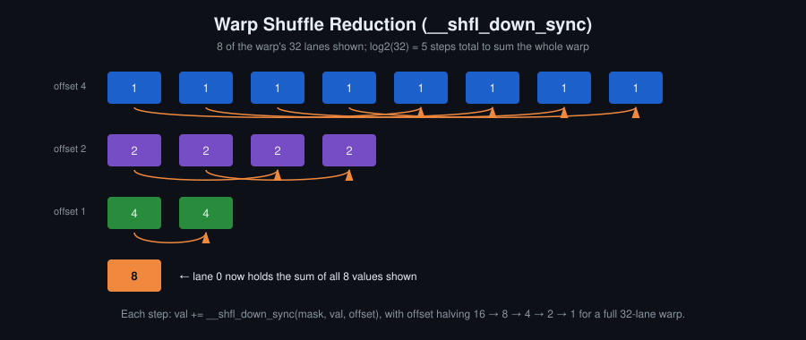
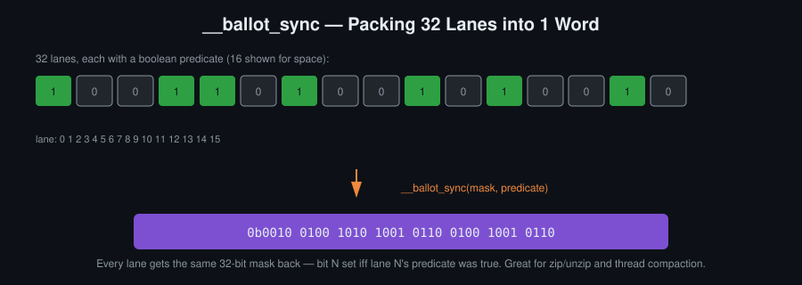

# Օր 7. Warp intrinsic-ներ, reduction և atomic-ներ

## Նպատակներ
- Օգտագործել warp shuffle ֆունկցիաները warp-ի ներսում տվյալներ փոխանակելու համար՝ առանց shared memory-ի և barrier-ների
- Ասել, թե ինչ է պնդում lane mask-ը, և ինչու է divergent branch-ում կանչված `_sync` intrinsic-ը undefined behaviour, ոչ թե պարզապես դանդաղ
- Իրականացնել warp-ի մակարդակի reduction և ընդլայնել այն block-ի վրա՝ warp, ապա shared memory, ապա կրկին warp սխեմայով
- Իրականացնել warp-ի ներսում inclusive scan, և երկուական պայմանների համար օգտագործել `__ballot_sync`-ը `__popc`-ի հետ
- Բացատրել, թե ինչու է atomic-ների մրցակցությունը սերիականացնում կատարումը, և կիրառել privatisation

## Հիմնական հասկացություններ
- `__shfl_down_sync`, `__shfl_up_sync`, `__shfl_xor_sync`, `__shfl_sync`
- Lane mask, divergence, և չեզոք արժեքներ սահմանից դուրս lane-երի համար
- Հիերարխիկ reduction՝ warp, ապա shared memory, ապա warp
- Inclusive scan (Kogge-Stone) և stream compaction
- `__syncwarp`, `__activemask`, `__ballot_sync`
- Atomic-ները կատարվում են L2-ում. մեկ հասցեի վրա մրցակցությունը սերիականացնում է
- Privatisation shared memory-ում. warp-aggregated atomic-ներ

## Սահմանումներ
**Lane** — Thread-ի դիրքը իր warp-ում՝ 0-ից 31։

**Warp shuffle** — `__shfl_sync`, `__shfl_up_sync`, `__shfl_down_sync`, `__shfl_xor_sync` հրամանների ընտանիքը, որը lane-ին թույլ է տալիս կարդալ նույն warp-ի մեկ այլ lane-ի ռեգիստրը՝ առանց հիշողության դիմումի և առանց barrier-ի։

**Lane mask** — Ամեն `_sync` intrinsic-ի առաջին՝ 32-բիթանոց արգումենտը, մեկ բիթ ամեն lane-ի համար։ Նշում է այն lane-երը, որոնք պետք է մասնակցեն։ `0xffffffff`-ը նշանակում է ամբողջ warp-ը։

**`_sync` վերջածանց** — Նշում է այն intrinsic-ները, որոնք պահանջում են, որ նշված lane-երը միասին հասնեն այդ հրամանին։ Եթե mask-ում նշված lane-երից որևէ մեկը չի հասնում, արդյունքը undefined է, ոչ թե պարզապես դանդաղ։ Առանց վերջածանցի ձևերը հանված են լեզվից։

**XOR (butterfly) փոխանակում** — `__shfl_xor_sync(mask, v, k)`. lane `i`-ն փոխանակում է lane `i ^ k`-ի հետ։ Մեկ հրամանով ամեն lane և՛ ուղարկում է, և՛ ստանում, և հենց դրա համար է այս ձևն օգտագործվում, երբ արդյունքը պետք է բոլոր lane-երին։

**Reduction** — N արժեքը մեկ արժեքի միավորել ասոցիատիվ գործողությամբ։ GPU-ի վրա արվում է ծառի տեսքով՝ warp-ի ներսում shuffle-ներով, warp-երի միջև shared memory-ով, ապա կրկին մեկ warp-ով։

**Inclusive և exclusive scan** — Նախածանցային գումարներ (prefix sums)։ Inclusive scan-ի i-րդ տարրը 0-ից i տարրերի համակցությունն է, exclusive scan-ինը՝ 0-ից i-1։

**Kogge-Stone** — Warp-ի ներսում օգտագործվող scan-ի ձևը. k-րդ քայլում ամեն lane իրեն գումարում է իրենից k դիրքով ցածր lane-ի արժեքը, և k-ն ամեն քայլ կրկնապատկվում է։ 32 lane-անոց warp-ի համար հինգ քայլ է։

**Stream compaction** — Հեռացնել պայմանին չբավարարող տարրերը և մնացածը խտացնել։ Պայմանի վրա կատարված scan-ը ամեն մնացող տարրին տալիս է նրա ելքային index-ը։

**`__ballot_sync`** — Վերադարձնում է 32-բիթանոց mask, որում N-րդ բիթը դրված է, եթե N-րդ lane-ի պայմանը ճիշտ էր։ Արդյունքը ստանում են բոլոր մասնակից lane-երը։

**`__popc`** — Հաշվում է 32-բիթանոց արժեքի մեկ դրված բիթերը։ Ballot-ի արդյունքի վրա կիրառելիս հաշվում է պայմանին բավարարող lane-երը։

**`__activemask`** — Վերադարձնում է այն lane-երը, որոնք այս հրամանին միասին են հասել։ Ցույց է տալիս, թե ինչպես է պատահաբար ստացվել, և չի փոխարինում այն mask-ին, որ կոդն ինքը պետք է որոշի։

**`__syncwarp`** — Warp-ի մակարդակի barrier, որը ստիպում է նշված lane-երին միավորվել։ Պետք է այնտեղ, որտեղ կոդը հենվում է lane-երի միասին լինելու վրա, իսկ կոմպիլյատորը չի կարող դա ապացուցել։

**Atomic գործողություն** — Կարդալ-փոխել-գրել մեկ հասցեի վրա, որի մեջ ոչ մի այլ thread չի կարող միջամտել՝ `atomicAdd`, `atomicCAS`, `atomicMax` և մյուսները։

**Atomic-ների մրցակցություն (contention)** — Մի քանի thread դիմում է նույն հասցեին։ Թարմացումները սերիականացվում են L2-ում, ուստի գինն աճում է բախվող thread-երի քանակով, ոչ թե atomic հրամանների քանակով։

**Privatisation** — Ամեն block-ին կամ ամեն warp-ին տալ մրցակցային կուտակիչի սեփական պատճենը, թարմացնել այն տեղում և վերջում մեկ անգամ միավորել։ Յուրաքանչյուր մուտքային տարրի համար մեկ global atomic-ը դառնում է մի քանի atomic ամբողջ block-ի համար։ Atomic-ների մրցակցության ստանդարտ լուծումն է։

**Warp-aggregated atomic-ներ** — Warp-ի ամբողջ ներդրման համար մեկ atomic, որ կատարում է մեկ lane՝ այն նախապես հաշվելով ballot-ով և warp reduction-ով։ Atomic-ների քանակը կրճատում է մինչև 32 անգամ։ Privatisation-ի դեպքն է՝ warp-ի մակարդակում։

**Cooperative groups** — API, որը բացահայտ է դարձնում, թե կոդն ինչ խմբի վրա է սինխրոնանում՝ block, այս պահին միասին գտնվող lane-եր, ամբողջ grid։ `__syncthreads()`-ում այդ խումբը թաքնված է։

## Ինչու են shuffle-ները հաղթում
Shuffle-ները տվյալները տեղափոխում են ռեգիստրից ռեգիստր, հիշողությանն ընդհանրապես չդիմելով։ Հենց դրա համար են գերազանցում shared memory-ով reduction-ին, և հենց դրա համար է այդ առավելությունը անհետանում, երբ տվյալներն այլևս չեն տեղավորվում warp-ի ռեգիստրներում։

## Պատկեր

`__shfl_down_sync`-ը թույլ է տալիս lane-ին արժեքը կարդալ ուղիղ այլ lane-ի ռեգիստրից՝ առանց shared memory-ի և առանց `__syncthreads()`-ի։ Ամեն քայլ offset-ը կիսելով 32 արժեքը գումարվում է հինգ քայլով, և արդյունքը մնում է lane 0-ում։ Ամբողջ warp-ի համար offset-ները 16, 8, 4, 2, 1 են։

`__ballot_sync`-ը «որ lane-երն են բավարարում այս պայմանին» հարցը դարձնում է մեկ 32-բիթանոց ամբողջ թիվ, որ ստանում է ամեն lane։ N-րդ բիթը դրված է այն և միայն այն դեպքում, երբ N-րդ lane-ի պայմանը ճիշտ էր։ `__popc`-ի հետ միասին դրանք հաշվում է մեկ հրամանով։ Նույն մեխանիզմով են `__activemask`-ը և `__syncwarp`-ը իմանում, թե որ lane-երն են դեռ մասնակցում։

## Անիմացիա

Նույն ութ lane-ը՝ երեք intrinsic-ի տակ։ `__shfl_down_sync`-ը և `__shfl_up_sync`-ը արժեքները տեղաշարժում են մեկ ուղղությամբ՝ ֆիքսված offset-ով։ `__shfl_xor_sync`-ը արժեքները փոխանակում է զույգ lane-երի միջև (`i` և `i ^ mask`), ուստի մեկ հրամանով ամեն lane և՛ ուղարկում է, և՛ ստանում։ Հենց դրա համար է այն օգտագործվում butterfly reduction-ում։

## Գրականություն
- [CUDA C Programming Guide](https://docs.nvidia.com/cuda/pdf/CUDA_C_Programming_Guide.pdf) — 7.22. Warp Shuffle Functions · 7.14. Atomic Functions · 8. Cooperative Groups
- [`INTRINSICS.md`](../INTRINSICS.md) — shuffle, vote, բիթային գործողություններ և atomic-ներ՝ մեկ աղյուսակում
- CUB-ի device-wide reduction և scan: https://nvidia.github.io/cccl/cub/

## Լաբորատոր առաջադրանք
Հաշվել իրական պատկերի միջին արժեքը warp reduction-ով և `atomicAdd`-ով։ Ապա 256 bin-անոց histogram երկու անգամ՝ մեկ անգամ global atomic-ներով, մեկ անգամ privatised՝ shared memory-ում։

## Ինքնուրույն աշխատանք
1. Իրականացնել warp-ի գումարման reduction `__shfl_down_sync`-ով։ Ստուգել host-ի ցիկլի դեմ `n = 1024` մեկերով լցված զանգվածի վրա. արդյունքը պետք է ճշգրիտ `n` լինի։
2. Ընդլայնել մինչև `block_reduce_sum`՝ warp, shared memory, warp սխեմայով, ապա grid-ը reduction անել՝ ամեն block-ի thread 0-ն իր գումարը ավելացնում է `atomicAdd`-ով։ Հաշվել `__syncthreads()`-ի կանչերը դասական shared memory ծառային reduction-ի համեմատ և չափել երկուսի ժամանակը։
3. Իրականացնել warp-ի ներսում inclusive scan և դրանով խտացնել շեմից բարձր պիքսելների index-ները։
4. Կրկնել 3-րդ առաջադրանքը `__ballot_sync`-ով և `__popc`-ով, և համեմատել։
5. Իրականացնել 256 bin-անոց histogram երկու ձևով։ Չափել երկուսը մեծ պատկերի վրա, ապա գրեթե միագույն պատկերի վրա։ Բացատրել՝ տարբերությունը մեծանում է, թե փոքրանում։
6. Shared memory-ի `atomicAdd`-ը փոխարինել `atomicAdd_block`-ով և չափել։

## Ինքնաստուգում
Պատասխանները տրված չեն։

1. Ինչու՞ `__shfl_down_sync`-ին `__syncthreads()` պետք չէ։
2. Reduction-ի հինգ քայլից հետո ինչու՞ է հենց lane 0-ն երաշխավորված պահում ընդհանուր գումարը։
3. `0xFFFFFFFF` փոխանցելը, երբ հրամանին հասնում են lane-երի միայն մի մասը, undefined behaviour է։ Ինչու՞ ձեր GPU-ի վրա ստացված ճիշտ պատասխանը ճշտության ապացույց չէ։
4. Privatisation-ը ավելացնում է զրոյացման անցում, երկու barrier և միավորման անցում։ Նկարագրել մուտք, որի դեպքում դա ընդհանուր առմամբ կորուստ է։
5. Ինչու՞ է shared memory-ի `atomicAdd`-ը global-ից էժան, եթե երկուսն էլ բախման դեպքում սերիականացվում են։

## Կոդի template
Տես [`template.cu`](template.cu)։
