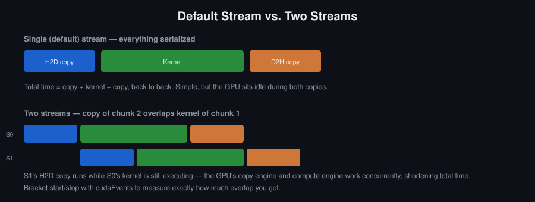
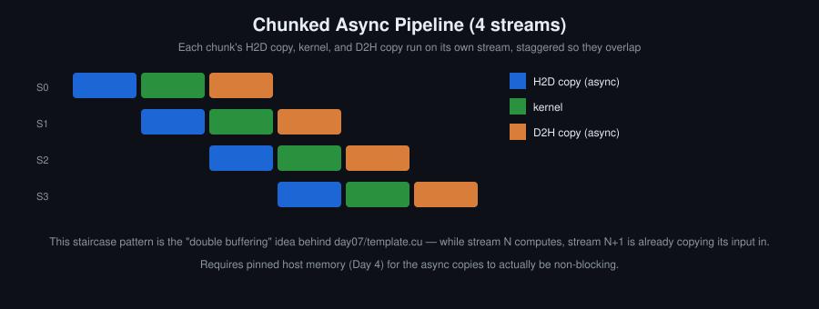
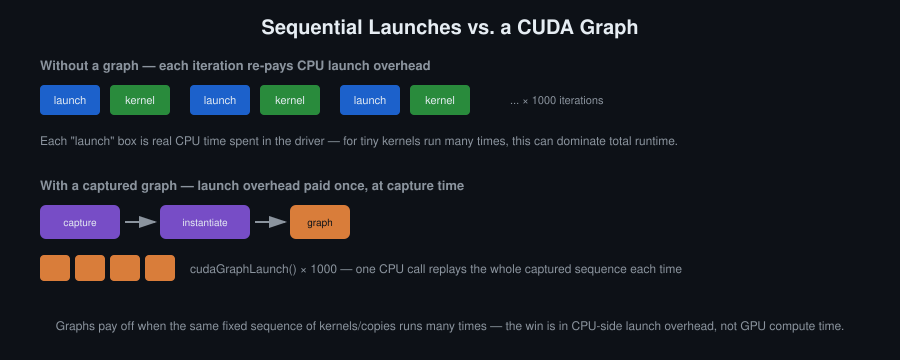

# Day 8: Streams, Events, Asynchrony and CUDA Graphs

## Objectives
- Distinguish synchronous and asynchronous `cudaMemcpy` and explain when the async form silently becomes synchronous
- Overlap transfer with computation across streams, and confirm the overlap with events and Nsight Systems
- Time on the device with events rather than on the host
- Capture a sequence of operations into a CUDA graph, and say when graph launch pays off

## Key Concepts
- Default stream semantics and why it serialises independent work
- `cudaMemcpyAsync`, stream dependencies, and the pinned-memory requirement
- Events: `cudaEventCreate`, `cudaEventRecord`, `cudaEventSynchronize`, `cudaEventElapsedTime`
- Chunked pipelines: copy, compute and copy-back in flight at once
- Graph capture, instantiation and launch; launch overhead amortisation

## Definitions
**Stream** — An ordered queue of GPU operations, kernels and copies. Operations in different streams may run concurrently; operations within one stream execute in issue order.

**Default stream (per-thread)** — The stream used when none is named. Compiled with `--default-stream per-thread`, each host thread gets its own default stream, which does not serialise against other streams.

**`cudaMemcpyAsync`** — A copy issued into a stream, returning immediately. It is genuinely asynchronous only when the host memory is page-locked; with pageable memory the runtime falls back to a synchronous copy and does not report it.

**Event** — A marker placed in a stream with `cudaEventRecord`, which completes when all work preceding it in that stream completes. Used to wait, `cudaEventSynchronize`, and to measure, `cudaEventElapsedTime`.

**Stream dependency** — Ordering between streams, expressed by recording an event in one and having another wait on it with `cudaStreamWaitEvent`.

**Device-side timing** — Measuring with events rather than a host clock, so the interval measured is the GPU's and excludes host-side launch latency.

**Double buffering** — Splitting the input into chunks and using two or more sets of buffers and streams, so that while chunk n is computed, chunk n+1 is copied in and chunk n-1 copied out. The ceiling becomes the larger of the transfer and compute rates rather than their sum.

**CUDA graph** — A recorded directed acyclic graph of operations — kernels, copies, host callbacks — together with their dependencies, launched as one unit.

**Graph capture** — Recording a sequence of stream operations into a graph instead of executing it, between `cudaStreamBeginCapture` and `cudaStreamEndCapture`.

**Instantiation** — Turning a captured graph into an executable graph with `cudaGraphInstantiate`. Done once; the work of validating and preparing the launches is paid here instead of at every launch.

**Launch overhead** — The host-side cost of issuing one kernel launch. It is what graphs remove, and it matters when a fixed sequence of short kernels runs many times.

## Where this connects to Day 4
Day 4 established that the link is often the limit. Streams are the answer: while chunk *n* is computed, chunk *n+1* is being copied in and chunk *n-1* copied out. The ceiling is then the larger of the two rates, not their sum.

## Visual

The default stream runs everything in order, so the compute units are idle during both copies. With two or more streams the copy engine and the compute engine work at the same time. Events are how the saving is measured.

The pattern the hands-on task builds: split the input into chunks, put each chunk's copy-in, compute and copy-out on its own stream, and issue them so consecutive chunks overlap. It only works with pinned host buffers (Day 4); otherwise `cudaMemcpyAsync` falls back to synchronous behaviour without saying so.

Graphs do not make the GPU compute faster. They remove the CPU-side cost of re-issuing the same sequence of launches, which is visible only when a fixed pipeline runs many times.

## Resources
- [CUDA C Programming Guide](https://docs.nvidia.com/cuda/pdf/CUDA_C_Programming_Guide.pdf) — 3.2.8. Asynchronous Concurrent Execution · 3.2.8.7. CUDA Graphs
- CUDA C++ Best Practices Guide — Asynchronous Transfers and Overlapping Transfers with Computation
- Nsight Systems — User Guide, timeline view

## Hands-On Task
Process an image in row chunks across several streams, overlapping transfer and computation. Then capture the sequence into a graph and replay it.

## Self-Learning
1. Overlap an async host-to-device copy with kernel execution using two streams; confirm the overlap with events and in the Nsight Systems timeline.
2. Time a kernel with events and compare with your earlier host-side `<chrono>` measurement. Explain the difference.
3. Increase the number of streams from 2 to 4 to 8 and record where the overlap stops improving.
4. Capture the chunked pipeline into a CUDA graph. Launch it 1000 times and compare against 1000 sequential launches.
5. Remove the pinned allocation from the async path and measure what happens.

## Self-Check
No answers given.

1. Why does `cudaMemcpyAsync` behave synchronously if the host buffer is not pinned?
2. What goes wrong if you call `cudaEventElapsedTime` without `cudaEventSynchronize` first?
3. Why does adding more streams eventually stop helping?
4. Why does capturing kernels into a graph not make the GPU compute anything faster?
5. During `cudaStreamBeginCapture`, does the launched kernel execute?

## Code Template
See [`template.cu`](template.cu).
