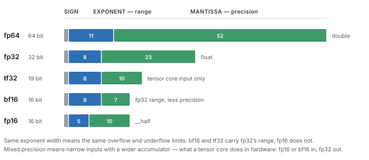

# Օր 9. Գրադարաններ, tensor core-եր և ճշգրտություն

## Նպատակներ
- Ձեռքով գրված kernel-ները փոխարինել cuBLAS-ով, cuFFT-ով, cuRAND-ով և cuDNN-ով, և ասել, թե երբ է սեփական kernel-ը դեռ արդարացված
- Բացատրել, թե ինչ է անում tensor core-ը և ինչ է պահանջում տվյալների դասավորությունից ու չափերից
- Համեմատել fp64-ի, fp32-ի, tf32-ի, bf16-ի և fp16-ի throughput-ը կլաստերի GPU-ի վրա և ասել, թե դա ինչ հետևանք ունի թվային հաշվարկների համար
- Բացատրել, թե ինչու atomic-ներով կուտակումը գործարկումից գործարկում չի վերարտադրվում

## Հիմնական հասկացություններ
- cuBLAS, cuSOLVER, cuSPARSE, cuFFT, cuRAND. CUB և Thrust
- cuDNN, NPP և nvJPEG. այն, ինչ իրականում կանչում է deep learning framework-ը
- Tensor core-եր՝ matrix multiply-accumulate մեկ հրամանով. հավասարեցման և չափերի պահանջներ
- Ճշգրտություն՝ fp64, fp32, tf32, bf16, fp16. fused multiply-add
- Atomic-ներով կուտակման ոչ դետերմինիզմը, և ինչ է պահանջում վերարտադրելիության պնդումը
- Cooperative groups՝ `tiled_partition`, խմբի տիպով shuffle-ներ, ամբողջ grid-ի սինխրոնացում

## Սահմանումներ
**Tensor Core** — SM-ի մասնագիտացված hardware, compute capability 7.0-ից և նոր, խառը ճշգրտությամբ արագ matrix multiply-accumulate-ի համար։ Օգտագործվում է cuBLAS-ի և cuDNN-ի կողմից, և ուղիղ հասանելի է warp matrix ֆունկցիաներով։

**MMA (matrix multiply-accumulate)** — Tensor core-ի գործողությունը՝ `D = A * B + C` փոքր մատրիցային հատվածների վրա, որ ուղարկվում է մեկ հրամանով ամեն warp-ի համար։ Հատվածների չափերը և հավասարեցումը ֆիքսված են hardware-ում, և հենց դրա համար չափերը պետք է հատվածի չափի բազմապատիկ լինեն։

**fp64, fp32, tf32, bf16, fp16** — Լողացող կետով ձևաչափեր՝ տրված էքսպոնենտի և մանտիսի բիթերով։ fp64՝ 11 և 52։ fp32՝ 8 և 23։ tf32՝ 8 և 10, միայն tensor core-ի մուտքի ձևաչափ։ bf16՝ 8 և 7, նույն տիրույթը, ինչ fp32-ը, ավելի ցածր ճշգրտությամբ։ fp16՝ 5 և 10, ավելի նեղ տիրույթ և ճշգրտություն։

**Խառը ճշգրտություն (mixed precision)** — Հաշվել նեղ ձևաչափով, իսկ կուտակել ավելի լայնով, սովորաբար fp16 կամ bf16 մուտքեր և fp32 կուտակում։ Tensor core-երը հենց այդպես են աշխատում։

**FMA (fused multiply-add)** — `a * b + c`-ն հաշվված մեկ կլորացմամբ՝ երկուսի փոխարեն։ Սա պատճառներից մեկն է, որ նույն մուտքերի և նույն հերթականության դեպքում GPU-ի և CPU-ի արդյունքները կարող են տարբերվել վերջին բիթերում։

**Atomic-ներով կուտակման ոչ դետերմինիզմ** — Atomic-ները չեն ամրագրում արժեքների միավորման հերթականությունը, իսկ լողացող կետով գումարումը ասոցիատիվ չէ։ Ուստի `atomicAdd`-ով float-եր կուտակող kernel-ը կարող է գործարկումից գործարկում տարբեր արդյունք տալ։ Վերարտադրելիության պնդումը պահանջում է reduction-ի ֆիքսված հերթականություն։

**Ամբողջ grid-ի սինխրոնացում** — Barrier grid-ի բոլոր block-երի համար, հասանելի cooperative groups-ով, և միայն `cudaLaunchCooperativeKernel`-ով գործարկված kernel-ների համար, որոնց չափն այնպիսին է, որ բոլոր block-երը միաժամանակ resident են։

**cuBLAS, cuFFT, cuRAND, cuDNN, NPP, nvJPEG, CUB, Thrust** — NVIDIA-ի գրադարանները՝ խիտ գծային հանրահաշիվ, արագ Ֆուրիեի ձևափոխություն, պատահական թվերի գեներացում, deep learning-ի պրիմիտիվներ, պատկերի և ազդանշանի մշակում, JPEG-ի վերծանում և կոդավորում, block-ի և device-ի մակարդակի զուգահեռ պրիմիտիվներ, և STL-ի նման ալգորիթմների շերտ՝ CUB-ի վրա։

## Ճշգրտությունը ձեր hardware-ի վրա
Սպառողական և inference-ի դասի քարտերի վրա fp64-ը աշխատում է fp32-ի արագության 1/32-ից 1/64 մասով։ Տվյալների կենտրոնի քարտերի վրա այն մոտ է 1/2-ին։ Նախքան կրկնակի ճշգրտությամբ որևէ աշխատանք նախագծելը, Օր 1-ի թվերից որոշել, թե կլաստերի GPU-ն որ դեպքին է պատկանում։

## Պատկեր

Էքսպոնենտի դաշտը որոշում է տիրույթը, մանտիսը՝ ճշգրտությունը։ bf16-ը և tf32-ը պահում են fp32-ի 8-բիթանոց էքսպոնենտը, ուստի fp32-ում տեղավորվող արժեքը տեղավորվում է նաև դրանցում։ fp16-ի 5-բիթանոց էքսպոնենտի դեպքում այդպես չէ, և հենց դրա համար fp16-ով ուսուցումը պահանջում է loss scaling, իսկ bf16-ով՝ ոչ։ tf32-ը պահպանման ձևաչափ չէ. այն գոյություն ունի միայն որպես tensor core-ի մուտք, և հենց դրա համար cuBLAS-ը այն միացնում է math mode-ով, ոչ թե տվյալների տիպով։

## Գրականություն
- [CUDA C Programming Guide](https://docs.nvidia.com/cuda/pdf/CUDA_C_Programming_Guide.pdf) — 7.24. Warp Matrix Functions · 8. Cooperative Groups
- Train With Mixed Precision: https://docs.nvidia.com/deeplearning/performance/
- Micikevicius P. et al. Mixed Precision Training. *ICLR*, 2018. arXiv:1710.03740
- cuBLAS, cuFFT, cuRAND: https://docs.nvidia.com/cuda/ · cuDNN: https://docs.nvidia.com/deeplearning/cudnn/

## Լաբորատոր առաջադրանք
Երկու ձեռքով գրված kernel փոխարինել գրադարանային կանչերով՝ Օր 5-ի և Օր 6-ի box ֆիլտրը NPP-ով, իսկ մատրիցների բազմապատկումը՝ cuBLAS-ով։ Naive բազմապատկումը տրված է template-ում, ուստի այս առաջադրանքը կախված չէ Օր 5-ի ընդլայնված առաջադրանքից։ Ապա միացնել tensor core-երը և համեմատել և՛ արագությունը, և՛ արդյունքը։

## Ինքնուրույն աշխատանք
1. Մատրիցների բազմապատկումը կատարել cuBLAS-ով և համեմատել ձեր kernel-ի հետ՝ ժամանակով և արդյունքով։
2. Նույն բազմապատկման համար միացնել tf32, ապա bf16։ Գրանցել արագությունը և արդյունքի տարբերությունը fp32-ի համեմատ։
3. Profiler-ով հաստատել, որ tensor core-երն իրոք օգտագործվում են, ոչ թե ենթադրել։
4. Compute-bound kernel-ով չափել fp64-ի throughput-ը fp32-ի համեմատ կլաստերի GPU-ի վրա։ Համեմատել այդ քարտի համար հրապարակված հարաբերության հետ։
5. Նույն մեծ զանգվածը տասն անգամ գումարել `atomicAdd`-ով։ Գրանցել, արդյոք արդյունքները բիթ առ բիթ նույնն են, և բացատրել։
6. cuRAND-ով Monte Carlo-ի եղանակով գնահատել π-ն։

## Ինքնաստուգում
Պատասխանները տրված չեն։

1. Ինչու՞ Volta-ից հին GPU-ները tensor core չունեն, և ինչ է դա նշանակում դրանց վրա cuBLAS-ի համար։
2. Ուսանողը հայտնում է tensor core-երով 40 անգամ արագացում՝ առանց ճշգրտության կորստի։ Ի՞նչ կխնդրեիք ցույց տալ։
3. Ինչու՞ է `cg::tiled_partition<32>`-ը նախընտրելի ուղիղ `__shfl_down_sync`-ից, եթե երկուսն էլ կոմպիլացվում են նույն հրամանի։
4. Ի՞նչ պայմաններում է սեփական kernel գրելը դեռ ճիշտ պատասխան, երբ գրադարանային ֆունկցիա գոյություն ունի։

## Կոդի template
Տես [`template.cu`](template.cu)։
